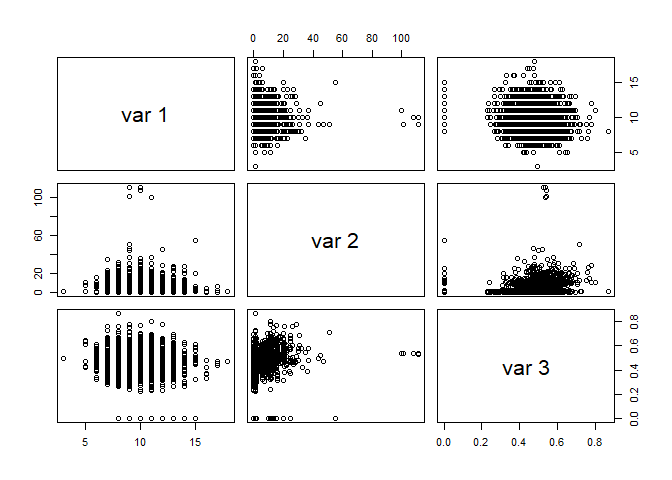
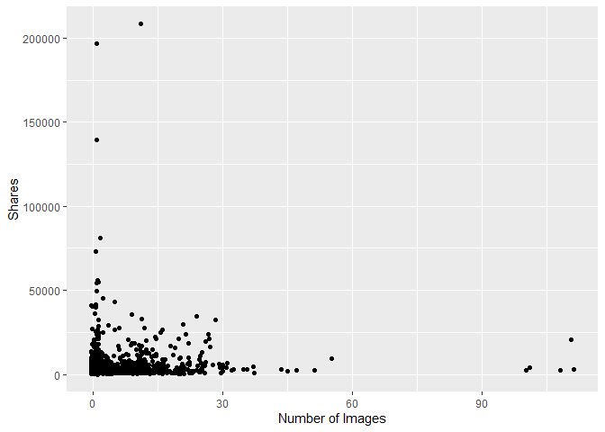
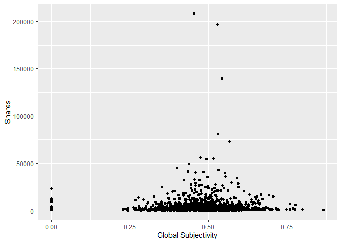
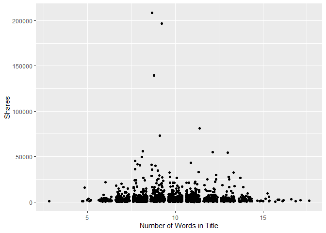

ST 558 Project 2
================
Stefanee Tillman & Kaitlyn Bayley
10/19/2021

``` r
rmarkdown::render("Project2.Rmd",
 output_format = "github_document",
 output_file = "README.md",
 output_options = list(
 toc = FALSE,
 toc_depth = 3,
 number_sections = FALSE,
 df_print = "default",
keep_html = FALSE
))
```

# Required Packages

``` r
require(readxl)
require(dplyr)
```

    ## Warning: package 'dplyr' was built under R version 4.0.5

``` r
#install.packages("randomForest")
library(randomForest)
```

    ## Warning: package 'randomForest' was built under R version 4.0.5

``` r
require(tidyr)
```

    ## Warning: package 'tidyr' was built under R version 4.0.5

``` r
require(caret)
```

    ## Warning: package 'ggplot2' was built under R version 4.0.5

``` r
require(gbm)
```

    ## Warning: package 'gbm' was built under R version 4.0.5

``` r
require(randomForest)
library(e1071)
```

    ## Warning: package 'e1071' was built under R version 4.0.5

``` r
require(knitr)
```

    ## Warning: package 'knitr' was built under R version 4.0.5

# Introduction Section

For this project, we are reviewing a dataset related to social media
shares and popularity of articles from Mashable. We initially subsetted
the data to analyze the lifestyle channel and find the best model to
predict the popularity of an article based on the most significant
variables. We can then automate this process to do the same for the
other identified channels (entertainment, business, social media,
technology, and world). \# Data

``` r
#Reading in Data
NewsData<- read_excel("OnlineNewsPopularity.xlsx")
#Subsetting Data
NewsData <- NewsData %>% filter(data_channel_is_lifestyle == 1) %>%
        select(-url, -timedelta, -data_channel_is_entertainment, -data_channel_is_bus, -data_channel_is_socmed, -data_channel_is_tech, -data_channel_is_world, -data_channel_is_lifestyle)
```

# Summarizations

``` r
NewsDataPairs <- cbind(NewsData$n_tokens_title, NewsData$num_imgs, NewsData$global_subjectivity)

pairs(NewsDataPairs)
```

<!-- -->

``` r
plotImages <- ggplot(data = NewsData, aes(x=num_imgs, y=shares))
plotImages + geom_jitter() +
  labs(x= "Number of Images", y = "Shares")
```

<!-- --> The data
points on this plot, visualizing how many shares result based on the
number of images, are clustered around the x-axis. It appears that more
images does not necessarily translate to more shares.

``` r
plotSubject <- ggplot(data = NewsData, aes(x=global_subjectivity, y=shares))
plotSubject + geom_jitter() +
  labs(x= "Global Subjectivity", y= "Shares")
```

<!-- --> This plot
compares global subjectivity and the number of shares. The subjectivity
is clustered around 0.5, which indicates that articles closer to neutral
generate more shares.

``` r
plotTitle <- ggplot(data = NewsData, aes(x=n_tokens_title, y=shares))
plotTitle + geom_jitter() +
  labs(x = "Number of Words in Title", y = "Shares")
```

<!-- --> This plot
looks at the number of words in the title and how that affects the
number of shares. It appears that titles that range from around 7-12
words or so in length generate more shares than title lengths outside of
that range.

``` r
means <- c(mean(NewsData$num_imgs), mean(NewsData$global_subjectivity), mean(NewsData$n_tokens_title))
SDs <- c(sd(NewsData$num_imgs), sd(NewsData$global_subjectivity), sd(NewsData$n_tokens_title))
```

``` r
summaryImages <- summarize(NewsData, mean(num_imgs), sd(num_imgs))
summaryImages
```

    ## # A tibble: 1 x 2
    ##   `mean(num_imgs)` `sd(num_imgs)`
    ##              <dbl>          <dbl>
    ## 1             4.90           8.15

``` r
summarySubject <- summarize(NewsData, mean(global_subjectivity), sd(global_subjectivity))
summarySubject
```

    ## # A tibble: 1 x 2
    ##   `mean(global_subjectivity)` `sd(global_subjectivity)`
    ##                         <dbl>                     <dbl>
    ## 1                       0.473                    0.0941

``` r
summaryTitle <- summarize(NewsData, mean(n_tokens_title), sd(n_tokens_title))
summaryTitle
```

    ## # A tibble: 1 x 2
    ##   `mean(n_tokens_title)` `sd(n_tokens_title)`
    ##                    <dbl>                <dbl>
    ## 1                   9.77                 1.91

``` r
summaryStats <- tbl_df(cbind(summaryImages, summarySubject, summaryTitle))
```

    ## Warning: `tbl_df()` was deprecated in dplyr 1.0.0.
    ## Please use `tibble::as_tibble()` instead.
    ## This warning is displayed once every 8 hours.
    ## Call `lifecycle::last_lifecycle_warnings()` to see where this warning was generated.

``` r
summaryStats
```

    ## # A tibble: 1 x 6
    ##   `mean(num_imgs)` `sd(num_imgs)` `mean(global_subjectivity)` `sd(global_subjec~
    ##              <dbl>          <dbl>                       <dbl>              <dbl>
    ## 1             4.90           8.15                       0.473             0.0941
    ## # ... with 2 more variables: mean(n_tokens_title) <dbl>,
    ## #   sd(n_tokens_title) <dbl>

These summary statistics of means and standard deviations help describe
the variables plotted above. The mean number of images is around 5, the
mean global subjectivity is just under 0.5, and the mean title length is
around 10 words.

``` r
tableVideosDay <- table(NewsData$num_videos, NewsData$weekday_is_wednesday)
tableVideosDay
```

    ##     
    ##         0    1
    ##   0  1330  301
    ##   1   271   62
    ##   2    50   15
    ##   3    17    4
    ##   4     6    1
    ##   5     6    2
    ##   6     4    0
    ##   7     4    0
    ##   8     3    0
    ##   9     2    0
    ##   10    8    1
    ##   11    4    1
    ##   12    2    0
    ##   15    1    0
    ##   21    1    0
    ##   26    0    1
    ##   28    1    0
    ##   50    1    0

This categorical table shows the number of videos in an article and
whether it was shared on a Wednesday. \# Modeling

``` r
#Split data into training and test set 70:30
set.seed(1)
dt = sort(sample(nrow(NewsData), nrow(NewsData) * .7))
train<- NewsData[dt,]
test<- NewsData[-dt,]
```

# Explanation of of the idea of a linear regression model-Stefanee Tillman

A linear regression model is a model that displays the relationship
between two or more variables. Here we are demonstrating the
relationship between Lifestyle and Shares. With the predictors used in
the formula and shares being the response we are attempting to see the
relationship between the two. Does Lifestyle have a significant effect
on the amount of shares? Is there a correlation between the variables?

``` r
#Fit Linear Regression Model 1- All Predictors
model1 <- lm(shares~., data=train)
summary(model1)
```

    ## 
    ## Call:
    ## lm(formula = shares ~ ., data = train)
    ## 
    ## Residuals:
    ##    Min     1Q Median     3Q    Max 
    ## -25010  -3042  -1239    684 196708 
    ## 
    ## Coefficients: (4 not defined because of singularities)
    ##                                Estimate Std. Error t value Pr(>|t|)    
    ## (Intercept)                   5.145e+02  4.080e+03   0.126 0.899659    
    ## n_tokens_title                1.101e+02  1.452e+02   0.758 0.448414    
    ## n_tokens_content              2.347e+00  8.254e-01   2.844 0.004523 ** 
    ## n_unique_tokens              -8.432e+03  9.218e+03  -0.915 0.360467    
    ## n_non_stop_words             -1.214e+04  8.637e+03  -1.406 0.160022    
    ## n_non_stop_unique_tokens      1.714e+04  7.886e+03   2.174 0.029888 *  
    ## num_hrefs                     4.020e+01  2.864e+01   1.404 0.160599    
    ## num_self_hrefs               -1.184e+02  9.930e+01  -1.192 0.233506    
    ## num_imgs                     -3.036e+01  4.931e+01  -0.616 0.538206    
    ## num_videos                    4.452e+02  1.233e+02   3.612 0.000315 ***
    ## average_token_length          4.716e+02  1.148e+03   0.411 0.681315    
    ## num_keywords                  4.837e+01  1.874e+02   0.258 0.796348    
    ## kw_min_min                   -1.659e+00  6.020e+00  -0.276 0.782846    
    ## kw_max_min                   -8.807e-02  2.423e-01  -0.364 0.716268    
    ## kw_avg_min                   -1.253e-01  1.621e+00  -0.077 0.938384    
    ## kw_min_max                    1.509e-03  1.996e-02   0.076 0.939730    
    ## kw_max_max                    6.505e-05  2.304e-03   0.028 0.977479    
    ## kw_avg_max                   -1.004e-02  5.966e-03  -1.682 0.092763 .  
    ## kw_min_avg                   -5.707e-01  3.308e-01  -1.725 0.084750 .  
    ## kw_max_avg                   -1.609e-01  9.171e-02  -1.754 0.079585 .  
    ## kw_avg_avg                    1.862e+00  5.859e-01   3.178 0.001513 ** 
    ## self_reference_min_shares     1.278e-01  7.059e-02   1.811 0.070352 .  
    ## self_reference_max_shares     2.384e-02  4.226e-02   0.564 0.572799    
    ## self_reference_avg_sharess   -8.795e-02  1.021e-01  -0.862 0.389064    
    ## weekday_is_monday             1.440e+03  1.073e+03   1.342 0.179820    
    ## weekday_is_tuesday            6.555e+02  1.065e+03   0.615 0.538360    
    ## weekday_is_wednesday         -5.067e+02  1.023e+03  -0.495 0.620349    
    ## weekday_is_thursday          -2.739e+02  1.057e+03  -0.259 0.795533    
    ## weekday_is_friday            -4.056e+02  1.076e+03  -0.377 0.706221    
    ## weekday_is_saturday           3.471e+02  1.205e+03   0.288 0.773361    
    ## weekday_is_sunday                    NA         NA      NA       NA    
    ## is_weekend                           NA         NA      NA       NA    
    ## LDA_00                       -4.303e+01  1.109e+03  -0.039 0.969056    
    ## LDA_01                       -1.556e+03  2.804e+03  -0.555 0.579046    
    ## LDA_02                       -1.883e+03  2.581e+03  -0.729 0.465826    
    ## LDA_03                        2.320e+03  1.835e+03   1.264 0.206285    
    ## LDA_04                               NA         NA      NA       NA    
    ## global_subjectivity           1.040e+03  4.299e+03   0.242 0.808911    
    ## global_sentiment_polarity    -6.590e+03  7.968e+03  -0.827 0.408343    
    ## global_rate_positive_words    3.268e+04  3.562e+04   0.917 0.359044    
    ## global_rate_negative_words   -1.391e+04  8.640e+04  -0.161 0.872077    
    ## rate_positive_words          -2.219e+03  6.942e+03  -0.320 0.749298    
    ## rate_negative_words                  NA         NA      NA       NA    
    ## avg_positive_polarity         6.086e+03  6.730e+03   0.904 0.365982    
    ## min_positive_polarity        -4.168e+03  5.295e+03  -0.787 0.431265    
    ## max_positive_polarity        -2.452e+03  2.066e+03  -1.187 0.235589    
    ## avg_negative_polarity        -3.877e+02  5.669e+03  -0.068 0.945490    
    ## min_negative_polarity         9.122e+02  1.962e+03   0.465 0.641953    
    ## max_negative_polarity        -2.260e+03  4.897e+03  -0.461 0.644580    
    ## title_subjectivity            3.387e+02  1.197e+03   0.283 0.777332    
    ## title_sentiment_polarity      6.295e+02  1.237e+03   0.509 0.610875    
    ## abs_title_subjectivity        1.913e+03  1.663e+03   1.150 0.250136    
    ## abs_title_sentiment_polarity -1.067e+03  1.745e+03  -0.611 0.541013    
    ## ---
    ## Signif. codes:  0 '***' 0.001 '**' 0.01 '*' 0.05 '.' 0.1 ' ' 1
    ## 
    ## Residual standard error: 9814 on 1420 degrees of freedom
    ## Multiple R-squared:  0.06066,    Adjusted R-squared:  0.02891 
    ## F-statistic:  1.91 on 48 and 1420 DF,  p-value: 0.0002136

Here the Adjusted R-squared value is .02891 which is fairly low. The
p-value is .0002 which is significant. The significant variables here
include: n\_tokens\_content, n\_non\_stop\_unique\_tokens, num\_videos,
and kw\_avg\_avg

``` r
#Fit Linear Regression Model 2- Significant Variables
model2 <- lm(shares~ n_tokens_content + n_non_stop_unique_tokens + num_videos + kw_avg_avg, data=train)
summary(model2)
```

    ## 
    ## Call:
    ## lm(formula = shares ~ n_tokens_content + n_non_stop_unique_tokens + 
    ##     num_videos + kw_avg_avg, data = train)
    ## 
    ## Residuals:
    ##    Min     1Q Median     3Q    Max 
    ## -25461  -2581  -1657   -229 202309 
    ## 
    ## Coefficients:
    ##                            Estimate Std. Error t value Pr(>|t|)    
    ## (Intercept)              -1843.2849  1946.8898  -0.947  0.34390    
    ## n_tokens_content             1.3512     0.4761   2.838  0.00460 ** 
    ## n_non_stop_unique_tokens  3087.8200  2372.5884   1.301  0.19331    
    ## num_videos                 405.6970   118.1184   3.435  0.00061 ***
    ## kw_avg_avg                   0.7292     0.1852   3.938  8.6e-05 ***
    ## ---
    ## Signif. codes:  0 '***' 0.001 '**' 0.01 '*' 0.05 '.' 0.1 ' ' 1
    ## 
    ## Residual standard error: 9843 on 1464 degrees of freedom
    ## Multiple R-squared:  0.0259, Adjusted R-squared:  0.02323 
    ## F-statistic:  9.73 on 4 and 1464 DF,  p-value: 9.109e-08

# Explanation of of the idea of a Random Forest Ensemble-Stefanee Tillman

A random forest is a machine learning technique that’s used to solve
regression and classification problems. The Random Forest Technique
extends the idea of bagging and is generally better than bagging.The
Random Forest will create multiple trees from bootstrap samples and
average the results. For this project, we are using the Random Forest
model after subsetting the data\_channel\_is\_lifestyle variable. After
using the Cross Validation Method we are able to observe the RMSE and
R^2 values for the predictor variables with shares as the response.

``` r
#Random Forest Model using Cross-Validation
rfmodel <- train(shares ~ n_tokens_title + num_hrefs + num_imgs + average_token_length + kw_min_min, data = train, method = "rf", trControl = trainControl(method= "cv", number = 5), preProcess = c("center", "scale"), tuneGrid = data.frame(mtry = 1:18))
print(rfmodel)
```

    ## Random Forest 
    ## 
    ## 1469 samples
    ##    5 predictor
    ## 
    ## Pre-processing: centered (5), scaled (5) 
    ## Resampling: Cross-Validated (5 fold) 
    ## Summary of sample sizes: 1174, 1175, 1176, 1176, 1175 
    ## Resampling results across tuning parameters:
    ## 
    ##   mtry  RMSE      Rsquared     MAE     
    ##    1    8905.436  0.004027738  3555.214
    ##    2    9130.034  0.003618963  3725.314
    ##    3    9209.712  0.004940549  3779.164
    ##    4    9336.863  0.003932496  3828.658
    ##    5    9477.804  0.004504587  3874.993
    ##    6    9482.979  0.004051136  3870.848
    ##    7    9463.483  0.004097831  3858.026
    ##    8    9443.038  0.004554881  3858.580
    ##    9    9466.536  0.005248171  3871.585
    ##   10    9448.243  0.005467186  3847.828
    ##   11    9510.850  0.004497650  3883.723
    ##   12    9459.222  0.004644774  3876.147
    ##   13    9444.914  0.004562812  3856.960
    ##   14    9536.928  0.004125686  3907.840
    ##   15    9470.201  0.004733636  3869.664
    ##   16    9496.626  0.003774862  3873.869
    ##   17    9501.514  0.003832276  3876.760
    ##   18    9447.496  0.004738928  3875.546
    ## 
    ## RMSE was used to select the optimal model using the smallest value.
    ## The final value used for the model was mtry = 1.

``` r
#Boosted Tree
gbmGrid <-  expand.grid(interaction.depth = 1:4,
                        n.trees = c(25, 50, 100, 150, 200),
                        shrinkage = 0.1,
                        n.minobsinnode = 10)
nrow(gbmGrid)
```

    ## [1] 20

``` r
fitControl <- trainControl(method = "repeatedcv", number = 5, repeats = 3)
boostFit <- train(shares~ n_tokens_title + num_hrefs + num_imgs + average_token_length + kw_min_min,
                data = train,
                preProcess = c("center", "scale"),
                trControl = fitControl,
                method = "gbm",
                tuneGrid = gbmGrid)
```

    ## Iter   TrainDeviance   ValidDeviance   StepSize   Improve
    ##      1 50347078.2633             nan     0.1000 -5264.6301
    ##      2 50250677.9742             nan     0.1000 44789.9784
    ##      3 50109622.5321             nan     0.1000 -50702.2538
    ##      4 49925897.3454             nan     0.1000 109923.0358
    ##      5 49854371.2658             nan     0.1000 19158.2783
    ##      6 49808617.1013             nan     0.1000 -17970.1861
    ##      7 49672849.1380             nan     0.1000 20214.8210
    ##      8 49580882.1447             nan     0.1000 86500.9802
    ##      9 49551800.4760             nan     0.1000 -48157.4202
    ##     10 49537038.8408             nan     0.1000 -53336.2845
    ##     20 49170428.7210             nan     0.1000 -33652.4602
    ##     40 48912465.2793             nan     0.1000 -34649.5925
    ##     60 48508064.7436             nan     0.1000 -71228.3591
    ##     80 48392469.4170             nan     0.1000 -117833.5208
    ##    100 48216997.8598             nan     0.1000 -5781.7596
    ##    120 48084728.9472             nan     0.1000 -194101.1536
    ##    140 47962465.1261             nan     0.1000 -31553.3605
    ##    160 47813612.1483             nan     0.1000 -57389.1403
    ##    180 47772375.6848             nan     0.1000 -144179.8078
    ##    200 47630731.1536             nan     0.1000 -42912.7569
    ## 
    ## Iter   TrainDeviance   ValidDeviance   StepSize   Improve
    ##      1 50271261.5801             nan     0.1000 222097.2356
    ##      2 50049630.6187             nan     0.1000 163070.5571
    ##      3 49684584.8623             nan     0.1000 25216.0948
    ##      4 49548451.7628             nan     0.1000 -2377.7670
    ##      5 49295275.2691             nan     0.1000 -7313.0924
    ##      6 48802471.0950             nan     0.1000 -177433.7080
    ##      7 48722970.4855             nan     0.1000 -49907.7852
    ##      8 48584357.7452             nan     0.1000 -266037.9233
    ##      9 48199503.4731             nan     0.1000 -62878.9178
    ##     10 48027913.7193             nan     0.1000 -105183.1425
    ##     20 46993231.2280             nan     0.1000 -27330.4071
    ##     40 45839813.9578             nan     0.1000 37614.8196
    ##     60 45155548.5753             nan     0.1000 -166286.8977
    ##     80 44474084.9413             nan     0.1000 -113324.5323
    ##    100 44098948.9703             nan     0.1000 -133664.2142
    ##    120 43675319.8845             nan     0.1000 -21220.8659
    ##    140 43171494.7946             nan     0.1000 -36563.0100
    ##    160 42748706.6182             nan     0.1000 -128966.8919
    ##    180 42315753.1460             nan     0.1000 -139504.8723
    ##    200 41808449.3333             nan     0.1000 -17747.2271
    ## 
    ## Iter   TrainDeviance   ValidDeviance   StepSize   Improve
    ##      1 50377469.1890             nan     0.1000 119980.3204
    ##      2 50168746.6587             nan     0.1000 184114.3139
    ##      3 49794270.1750             nan     0.1000 -169522.5034
    ##      4 49515526.3058             nan     0.1000 225420.3565
    ##      5 49394224.0536             nan     0.1000 19113.5853
    ##      6 49226164.8380             nan     0.1000 55778.9777
    ##      7 49004427.7804             nan     0.1000 -222823.0957
    ##      8 48811105.0310             nan     0.1000 -270414.9411
    ##      9 48592966.9120             nan     0.1000 33934.3348
    ##     10 48487324.5004             nan     0.1000 -169799.5125
    ##     20 47016651.5258             nan     0.1000 81627.3370
    ##     40 45215378.7577             nan     0.1000 -223460.8123
    ##     60 43268886.4493             nan     0.1000 -88345.8328
    ##     80 41735005.1073             nan     0.1000 -138618.0982
    ##    100 40635885.6713             nan     0.1000 -228684.1509
    ##    120 39483586.5119             nan     0.1000 -27625.4849
    ##    140 38470167.6316             nan     0.1000 -95885.5960
    ##    160 37764576.9576             nan     0.1000 -63671.0361
    ##    180 37068531.0609             nan     0.1000 -151822.6838
    ##    200 36210138.3020             nan     0.1000 -74168.4295
    ## 
    ## Iter   TrainDeviance   ValidDeviance   StepSize   Improve
    ##      1 50230300.4060             nan     0.1000 -103377.2624
    ##      2 49823952.9759             nan     0.1000 31113.2593
    ##      3 49546162.6809             nan     0.1000 69728.5257
    ##      4 49220307.7384             nan     0.1000 193908.6574
    ##      5 48706079.0439             nan     0.1000 14302.4250
    ##      6 48374097.2234             nan     0.1000 -69099.7617
    ##      7 48174071.2818             nan     0.1000 -171579.2015
    ##      8 47688453.5096             nan     0.1000 -167691.3819
    ##      9 47401140.5652             nan     0.1000 104910.4622
    ##     10 47271092.1401             nan     0.1000 45132.9954
    ##     20 45332801.1620             nan     0.1000 -39587.9324
    ##     40 43473620.7402             nan     0.1000 -297084.6317
    ##     60 41345625.8652             nan     0.1000 -485462.1812
    ##     80 40217630.8114             nan     0.1000 -290092.1547
    ##    100 38848571.0494             nan     0.1000 -79756.5910
    ##    120 37217653.7685             nan     0.1000 -149958.5640
    ##    140 36047757.2652             nan     0.1000 -137824.7435
    ##    160 35109995.0179             nan     0.1000 -109731.2342
    ##    180 33984172.7649             nan     0.1000 -130553.0482
    ##    200 33188716.9665             nan     0.1000 -93317.0726
    ## 
    ## Iter   TrainDeviance   ValidDeviance   StepSize   Improve
    ##      1 113528894.8234             nan     0.1000 -6479.0662
    ##      2 113445784.4970             nan     0.1000 -76432.0170
    ##      3 113341413.5395             nan     0.1000 18074.2213
    ##      4 113275338.3892             nan     0.1000 -5388.7122
    ##      5 113228459.3531             nan     0.1000 -29711.3806
    ##      6 113192947.9930             nan     0.1000 -89957.8108
    ##      7 113171707.2555             nan     0.1000 -48218.0743
    ##      8 113069390.6001             nan     0.1000 -94414.2167
    ##      9 113004388.2135             nan     0.1000 -92199.8172
    ##     10 112993898.8815             nan     0.1000 -59095.7569
    ##     20 112608860.8749             nan     0.1000 -107234.3739
    ##     40 112056863.7418             nan     0.1000 -26187.8570
    ##     60 111469564.3135             nan     0.1000 -144917.0246
    ##     80 111006839.0114             nan     0.1000 -88732.5151
    ##    100 110658027.1506             nan     0.1000 -52753.5085
    ##    120 110394909.0594             nan     0.1000 -138136.7359
    ##    140 110042844.9638             nan     0.1000 -8880.7029
    ##    160 109779407.3778             nan     0.1000 -72191.2766
    ##    180 109322733.9158             nan     0.1000 -96450.1668
    ##    200 109108699.4506             nan     0.1000 -62387.6350
    ## 
    ## Iter   TrainDeviance   ValidDeviance   StepSize   Improve
    ##      1 113420947.9313             nan     0.1000 -48203.6804
    ##      2 112925249.3643             nan     0.1000 -36352.2046
    ##      3 112846053.6761             nan     0.1000 -101057.3957
    ##      4 112648027.6000             nan     0.1000 -84167.4175
    ##      5 112563554.7545             nan     0.1000 -88496.3431
    ##      6 112406204.7939             nan     0.1000 -114251.2607
    ##      7 112095149.9306             nan     0.1000 -116908.6017
    ##      8 111923801.7781             nan     0.1000 -38346.0833
    ##      9 111830523.4484             nan     0.1000 -35627.6833
    ##     10 111732725.7904             nan     0.1000 -35792.8305
    ##     20 109710650.0684             nan     0.1000 -175028.7268
    ##     40 104138475.2606             nan     0.1000 -241032.8797
    ##     60 102103808.7306             nan     0.1000 -133543.2360
    ##     80 100713910.0143             nan     0.1000 -172102.6060
    ##    100 99387961.7309             nan     0.1000 -217454.2098
    ##    120 98068898.3673             nan     0.1000 -194010.9767
    ##    140 96924888.2774             nan     0.1000 -217342.8646
    ##    160 96306881.1694             nan     0.1000 -74305.8551
    ##    180 95398859.0872             nan     0.1000 -190476.3676
    ##    200 94152869.7421             nan     0.1000 -150776.6036
    ## 
    ## Iter   TrainDeviance   ValidDeviance   StepSize   Improve
    ##      1 113596819.4249             nan     0.1000 -66678.6973
    ##      2 113125291.8608             nan     0.1000 -67616.0238
    ##      3 112884138.8335             nan     0.1000 -14986.3325
    ##      4 112284147.9024             nan     0.1000 -146428.1206
    ##      5 112202213.6497             nan     0.1000 -151714.5408
    ##      6 111931659.8112             nan     0.1000 -171331.8322
    ##      7 111644048.9322             nan     0.1000 -206923.1282
    ##      8 111313183.2344             nan     0.1000 -245519.3667
    ##      9 110405580.8512             nan     0.1000 -37505.0693
    ##     10 110366083.1681             nan     0.1000 -173843.8010
    ##     20 106940263.8514             nan     0.1000 -144259.0002
    ##     40 103275344.6845             nan     0.1000 -283530.9332
    ##     60 99440398.5736             nan     0.1000 -200324.1409
    ##     80 95908674.2390             nan     0.1000 -400841.5394
    ##    100 93342434.9020             nan     0.1000 -90120.4604
    ##    120 90343690.9106             nan     0.1000 -352400.4692
    ##    140 87838476.2348             nan     0.1000 -323249.8960
    ##    160 85935315.0557             nan     0.1000 -497940.3017
    ##    180 84174203.3910             nan     0.1000 -189185.3520
    ##    200 81786930.1554             nan     0.1000 -271452.7372
    ## 
    ## Iter   TrainDeviance   ValidDeviance   StepSize   Improve
    ##      1 112976550.9141             nan     0.1000 -201066.8098
    ##      2 112790622.7956             nan     0.1000 -101951.7445
    ##      3 112704569.9632             nan     0.1000 -139457.0899
    ##      4 112515686.4980             nan     0.1000 14770.1798
    ##      5 111958698.5423             nan     0.1000 -234451.1602
    ##      6 110871349.3533             nan     0.1000 33524.8988
    ##      7 110572556.2705             nan     0.1000 -61698.1004
    ##      8 109987069.2639             nan     0.1000 -188166.0357
    ##      9 109383509.5544             nan     0.1000 92655.3511
    ##     10 109016808.5233             nan     0.1000 -376956.3721
    ##     20 103230970.1521             nan     0.1000 -272794.7852
    ##     40 95414257.1196             nan     0.1000 -292990.9853
    ##     60 91549579.2610             nan     0.1000 -286974.1984
    ##     80 88232084.4876             nan     0.1000 -440864.9162
    ##    100 84485879.4878             nan     0.1000 -431154.8682
    ##    120 81611518.6260             nan     0.1000 -532304.7310
    ##    140 78505711.1803             nan     0.1000 -212996.5710
    ##    160 76010004.1967             nan     0.1000 -415884.0328
    ##    180 74280682.7146             nan     0.1000 -417642.7598
    ##    200 71583546.1484             nan     0.1000 -326665.2434
    ## 
    ## Iter   TrainDeviance   ValidDeviance   StepSize   Improve
    ##      1 116469237.9151             nan     0.1000 90626.8268
    ##      2 116290528.1874             nan     0.1000 117223.7027
    ##      3 116126541.3342             nan     0.1000 49612.5687
    ##      4 116069518.3984             nan     0.1000 28599.3354
    ##      5 115967173.9932             nan     0.1000 55215.0318
    ##      6 115781246.9526             nan     0.1000 -108725.9226
    ##      7 115744355.5234             nan     0.1000 -62916.0003
    ##      8 115665852.7011             nan     0.1000 23471.3622
    ##      9 115545318.5218             nan     0.1000 -131889.0583
    ##     10 115409772.9088             nan     0.1000 30526.7259
    ##     20 114883566.9094             nan     0.1000 -66382.3900
    ##     40 114328203.8800             nan     0.1000 -102949.1679
    ##     60 113850436.8795             nan     0.1000 -131044.8935
    ##     80 113245698.6187             nan     0.1000 -16781.9407
    ##    100 112955123.9763             nan     0.1000 -116930.1213
    ##    120 112637985.3282             nan     0.1000 -50382.1971
    ##    140 112210448.8346             nan     0.1000 -21404.3450
    ##    160 111998367.5721             nan     0.1000 -132420.6636
    ##    180 111686186.9365             nan     0.1000 -79711.3739
    ##    200 111393582.5288             nan     0.1000 -137584.8473
    ## 
    ## Iter   TrainDeviance   ValidDeviance   StepSize   Improve
    ##      1 116429267.2923             nan     0.1000 -198431.8212
    ##      2 116292087.7326             nan     0.1000 -55904.5153
    ##      3 115948722.2529             nan     0.1000 -1641.1426
    ##      4 115641490.4647             nan     0.1000 -207632.0468
    ##      5 115126630.4402             nan     0.1000 -1529.3639
    ##      6 114766030.1497             nan     0.1000 -15008.6272
    ##      7 114679558.8039             nan     0.1000 -37042.2012
    ##      8 113285396.6270             nan     0.1000 532076.1954
    ##      9 113202283.9862             nan     0.1000 -130756.9760
    ##     10 112715576.2912             nan     0.1000 -177621.7024
    ##     20 109738308.4137             nan     0.1000 49430.4084
    ##     40 107072724.7862             nan     0.1000 -121833.2639
    ##     60 104982042.4163             nan     0.1000 -174003.9129
    ##     80 102951817.5529             nan     0.1000 -274269.3168
    ##    100 101630100.5402             nan     0.1000 -169608.7011
    ##    120 100532860.2366             nan     0.1000 -415223.4474
    ##    140 99270246.2227             nan     0.1000 -203850.7095
    ##    160 98445779.5077             nan     0.1000 -165714.1888
    ##    180 97618819.7651             nan     0.1000 -167793.8541
    ##    200 96023938.3474             nan     0.1000 -222859.2296
    ## 
    ## Iter   TrainDeviance   ValidDeviance   StepSize   Improve
    ##      1 116122037.8048             nan     0.1000 -73425.4880
    ##      2 115752003.7957             nan     0.1000 -27487.8827
    ##      3 115400842.8936             nan     0.1000 -40889.2929
    ##      4 114739948.8218             nan     0.1000 -81355.8691
    ##      5 114246541.0703             nan     0.1000 -169292.5608
    ##      6 113874535.9805             nan     0.1000 -113735.1548
    ##      7 112860822.5288             nan     0.1000 29384.5307
    ##      8 112632002.4959             nan     0.1000 -104981.3923
    ##      9 112385739.0171             nan     0.1000 -214950.3186
    ##     10 111889192.5955             nan     0.1000 -245768.2377
    ##     20 109080311.2533             nan     0.1000 -101481.4603
    ##     40 102483469.8473             nan     0.1000 104518.6653
    ##     60 99502402.7366             nan     0.1000 -171613.3550
    ##     80 95985569.8077             nan     0.1000 -271270.1164
    ##    100 93366834.2780             nan     0.1000 -355762.7009
    ##    120 91426044.2065             nan     0.1000 -1062879.1168
    ##    140 89846858.3842             nan     0.1000 -285945.4156
    ##    160 87377700.0467             nan     0.1000 -226434.1639
    ##    180 84923451.2372             nan     0.1000 -218657.8662
    ##    200 83140807.1609             nan     0.1000 -511226.4765
    ## 
    ## Iter   TrainDeviance   ValidDeviance   StepSize   Improve
    ##      1 115701059.8648             nan     0.1000 -380083.8853
    ##      2 115208925.4659             nan     0.1000 62089.7096
    ##      3 114495817.2843             nan     0.1000 -288656.7020
    ##      4 114259179.8210             nan     0.1000 -142009.8158
    ##      5 113815134.3189             nan     0.1000 -150634.1386
    ##      6 113269703.7121             nan     0.1000 -132795.3636
    ##      7 113326123.3619             nan     0.1000 -429430.9181
    ##      8 113209607.7855             nan     0.1000 -181242.5148
    ##      9 112696771.3040             nan     0.1000 -15724.9583
    ##     10 112036865.8213             nan     0.1000 -327245.3232
    ##     20 106937552.5875             nan     0.1000 -322966.1187
    ##     40 99555327.2687             nan     0.1000 -186230.8561
    ##     60 93506105.4073             nan     0.1000 -465476.9238
    ##     80 89576749.0860             nan     0.1000 -444280.8961
    ##    100 86513075.0598             nan     0.1000 -297466.8909
    ##    120 84178047.5265             nan     0.1000 -229770.4714
    ##    140 81233831.2655             nan     0.1000 -620631.9851
    ##    160 78595528.6118             nan     0.1000 -422031.9053
    ##    180 76258346.7174             nan     0.1000 -241261.4397
    ##    200 73712741.2916             nan     0.1000 -43223.9222
    ## 
    ## Iter   TrainDeviance   ValidDeviance   StepSize   Improve
    ##      1 101923855.3451             nan     0.1000 -104780.3990
    ##      2 101716847.9689             nan     0.1000 97203.8032
    ##      3 101558523.4875             nan     0.1000 47524.5656
    ##      4 101340478.9083             nan     0.1000 -39941.4308
    ##      5 101257954.4344             nan     0.1000 48188.1911
    ##      6 101167263.3006             nan     0.1000 -77487.2404
    ##      7 101150262.8166             nan     0.1000 -58489.2953
    ##      8 101096076.2778             nan     0.1000 -57944.2633
    ##      9 101005835.9495             nan     0.1000 36304.9165
    ##     10 100912713.1253             nan     0.1000 27455.1642
    ##     20 100292587.3492             nan     0.1000 -67087.6257
    ##     40 99633952.5780             nan     0.1000 -23766.6216
    ##     60 99038938.1404             nan     0.1000 -64356.6219
    ##     80 98741874.9606             nan     0.1000 -146985.6023
    ##    100 98373156.7451             nan     0.1000 -2035.8983
    ##    120 98008638.4355             nan     0.1000 -65341.1346
    ##    140 97612308.7665             nan     0.1000 -200147.9835
    ##    160 97349971.0207             nan     0.1000 -22171.7104
    ##    180 97027725.5903             nan     0.1000 -52118.7314
    ##    200 96818493.6247             nan     0.1000 -96214.7164
    ## 
    ## Iter   TrainDeviance   ValidDeviance   StepSize   Improve
    ##      1 101722546.5716             nan     0.1000 69141.6645
    ##      2 101580431.0771             nan     0.1000 21115.6152
    ##      3 101427474.9706             nan     0.1000 -67693.6927
    ##      4 101195032.0784             nan     0.1000 81422.4656
    ##      5 100909143.9042             nan     0.1000 -59153.9828
    ##      6 100707580.4395             nan     0.1000 169169.0189
    ##      7 100465869.9989             nan     0.1000 -1832.5786
    ##      8 100269319.3392             nan     0.1000 -212669.1088
    ##      9 100060546.2049             nan     0.1000 -11886.0990
    ##     10 99948170.9289             nan     0.1000 -34279.8516
    ##     20 97408910.6386             nan     0.1000 -151899.0205
    ##     40 92649565.3660             nan     0.1000 -24297.4470
    ##     60 91430457.4972             nan     0.1000 -180083.2145
    ##     80 90233927.0617             nan     0.1000 -310844.6354
    ##    100 88984375.0267             nan     0.1000 -111175.7097
    ##    120 87859640.5855             nan     0.1000 -119702.4207
    ##    140 86150761.1221             nan     0.1000 -192349.3586
    ##    160 85092583.1899             nan     0.1000 -252805.1943
    ##    180 83677687.8562             nan     0.1000 -301547.4910
    ##    200 83111698.6800             nan     0.1000 -181414.0800
    ## 
    ## Iter   TrainDeviance   ValidDeviance   StepSize   Improve
    ##      1 101561532.2308             nan     0.1000 171595.4716
    ##      2 100957223.0267             nan     0.1000 77723.2027
    ##      3 100298847.1885             nan     0.1000 -124669.0787
    ##      4 99946035.4295             nan     0.1000 -88141.0424
    ##      5 99202067.3952             nan     0.1000 -169529.4906
    ##      6 98990542.4169             nan     0.1000 -154187.7463
    ##      7 98653528.0063             nan     0.1000 -5937.3174
    ##      8 98532662.8908             nan     0.1000 -74884.2493
    ##      9 98167160.9860             nan     0.1000 72958.8334
    ##     10 97779784.0336             nan     0.1000 -407374.9919
    ##     20 95811304.6500             nan     0.1000 -124252.4114
    ##     40 88551942.8454             nan     0.1000 91340.7017
    ##     60 85623954.9063             nan     0.1000 -263798.7758
    ##     80 82268460.1100             nan     0.1000 -167948.8409
    ##    100 80235542.8521             nan     0.1000 -200121.5934
    ##    120 78195688.9350             nan     0.1000 -143327.2909
    ##    140 76095601.1602             nan     0.1000 -644525.3653
    ##    160 73943125.0459             nan     0.1000 -114750.4573
    ##    180 72249322.0916             nan     0.1000 -181874.1230
    ##    200 70965598.4453             nan     0.1000 7704.3832
    ## 
    ## Iter   TrainDeviance   ValidDeviance   StepSize   Improve
    ##      1 101160463.3081             nan     0.1000 112028.9589
    ##      2 100202070.0407             nan     0.1000 -89750.1879
    ##      3 99533085.0526             nan     0.1000 151542.9428
    ##      4 99034830.4967             nan     0.1000 -253116.0202
    ##      5 98350182.1316             nan     0.1000 -142884.2747
    ##      6 98100226.5475             nan     0.1000 71632.5628
    ##      7 97453065.1698             nan     0.1000 -176744.4455
    ##      8 96382735.8259             nan     0.1000 106983.7161
    ##      9 95759069.0021             nan     0.1000 -289857.7691
    ##     10 95459473.1736             nan     0.1000 -319524.2787
    ##     20 89894039.9871             nan     0.1000 -486141.9521
    ##     40 83415064.4950             nan     0.1000 -85625.9071
    ##     60 79353844.7055             nan     0.1000 -201162.3510
    ##     80 74740998.3916             nan     0.1000 -380422.2892
    ##    100 71636154.3060             nan     0.1000 -431187.9390
    ##    120 69351123.4123             nan     0.1000 -239479.1443
    ##    140 67264492.6774             nan     0.1000 -399594.7973
    ##    160 64754038.4446             nan     0.1000 -379976.9454
    ##    180 62227406.5004             nan     0.1000 -218692.7951
    ##    200 60263669.3459             nan     0.1000 -186009.9411
    ## 
    ## Iter   TrainDeviance   ValidDeviance   StepSize   Improve
    ##      1 112540750.0564             nan     0.1000 55744.2464
    ##      2 112473140.6278             nan     0.1000 -71019.3969
    ##      3 112365456.9182             nan     0.1000 59883.6272
    ##      4 112220031.4061             nan     0.1000 -50732.4508
    ##      5 112147015.1920             nan     0.1000 -72459.5906
    ##      6 112084569.3170             nan     0.1000 19985.3136
    ##      7 112006217.8510             nan     0.1000 -14101.5083
    ##      8 111928607.9940             nan     0.1000 -22952.4558
    ##      9 111838536.7699             nan     0.1000 -93060.2436
    ##     10 111788392.4997             nan     0.1000 -65074.4192
    ##     20 111428762.7473             nan     0.1000 -154709.6382
    ##     40 110826488.5747             nan     0.1000 -145958.9263
    ##     60 110209007.9268             nan     0.1000 36616.3181
    ##     80 109715761.1319             nan     0.1000 -5895.2558
    ##    100 109222160.5612             nan     0.1000 -130802.6249
    ##    120 108764625.8718             nan     0.1000 -89765.6431
    ##    140 108412000.9386             nan     0.1000 -63442.4444
    ##    160 108035251.8105             nan     0.1000 -68546.0346
    ##    180 107814063.3581             nan     0.1000 -78898.1117
    ##    200 107486416.0781             nan     0.1000 -94897.4403
    ## 
    ## Iter   TrainDeviance   ValidDeviance   StepSize   Improve
    ##      1 112360686.8046             nan     0.1000 9898.2498
    ##      2 112180615.6708             nan     0.1000 69588.5487
    ##      3 112040257.1147             nan     0.1000 -48565.2683
    ##      4 111763878.4442             nan     0.1000 149956.4845
    ##      5 111761444.2330             nan     0.1000 -146486.5679
    ##      6 111509050.0721             nan     0.1000 -35726.8179
    ##      7 111480330.2957             nan     0.1000 -102674.3580
    ##      8 111369807.1369             nan     0.1000 -132774.5824
    ##      9 111038363.6688             nan     0.1000 -232369.3582
    ##     10 110914146.3321             nan     0.1000 -10469.0458
    ##     20 108524408.6079             nan     0.1000 -29173.9519
    ##     40 104571391.6559             nan     0.1000 -102204.9873
    ##     60 101850988.0513             nan     0.1000 -112344.3376
    ##     80 99436796.3754             nan     0.1000 -127533.4286
    ##    100 97590436.0354             nan     0.1000 -216387.7431
    ##    120 96234292.6503             nan     0.1000 -132390.1416
    ##    140 95478734.3858             nan     0.1000 -248071.4026
    ##    160 94556019.5742             nan     0.1000 -143014.7309
    ##    180 92982397.9141             nan     0.1000 -97398.9816
    ##    200 92098461.6251             nan     0.1000 -170554.3067
    ## 
    ## Iter   TrainDeviance   ValidDeviance   StepSize   Improve
    ##      1 112228942.1080             nan     0.1000 -170209.1601
    ##      2 111749311.1156             nan     0.1000 -191818.8860
    ##      3 111414596.4639             nan     0.1000 -58482.7020
    ##      4 110905400.1264             nan     0.1000 -262017.5784
    ##      5 110765587.1323             nan     0.1000 7502.6021
    ##      6 109729055.1442             nan     0.1000 -48264.1628
    ##      7 108556247.4679             nan     0.1000 -37457.5195
    ##      8 108429013.0836             nan     0.1000 -76640.8175
    ##      9 107819226.8529             nan     0.1000 -434504.3819
    ##     10 107119348.9600             nan     0.1000 -204472.3292
    ##     20 103396648.9051             nan     0.1000 2729.2793
    ##     40 98893311.3532             nan     0.1000 -299492.5603
    ##     60 95002960.7243             nan     0.1000 -301450.6244
    ##     80 91777240.4230             nan     0.1000 -473202.1569
    ##    100 89060244.0556             nan     0.1000 -167877.7041
    ##    120 86244507.8787             nan     0.1000 51289.5073
    ##    140 83898787.0980             nan     0.1000 -131554.5300
    ##    160 82600187.4274             nan     0.1000 -76571.4350
    ##    180 80012630.3251             nan     0.1000 -326729.0832
    ##    200 78068748.1446             nan     0.1000 -141028.0858
    ## 
    ## Iter   TrainDeviance   ValidDeviance   StepSize   Improve
    ##      1 112176724.1765             nan     0.1000 -221419.1538
    ##      2 111448333.7339             nan     0.1000 -239403.0903
    ##      3 110862842.8753             nan     0.1000 -141794.8572
    ##      4 110057550.2614             nan     0.1000 -46492.5729
    ##      5 109333777.0879             nan     0.1000 -203132.6029
    ##      6 108818435.8751             nan     0.1000 -92414.0765
    ##      7 108033109.2672             nan     0.1000 -253235.2721
    ##      8 107518866.1840             nan     0.1000 -276317.2263
    ##      9 107074953.4310             nan     0.1000 -207255.4591
    ##     10 106370806.9695             nan     0.1000 -146785.4391
    ##     20 100626855.1383             nan     0.1000 -252346.0644
    ##     40 94625086.5297             nan     0.1000 -286316.7263
    ##     60 89657533.6835             nan     0.1000 -207889.1433
    ##     80 86728406.9677             nan     0.1000 -261129.5104
    ##    100 83723527.4304             nan     0.1000 -268145.9133
    ##    120 81056582.2948             nan     0.1000 -118957.6884
    ##    140 78933665.7660             nan     0.1000 -152355.0808
    ##    160 76541280.3929             nan     0.1000 -410347.3340
    ##    180 74905814.5821             nan     0.1000 -291463.5490
    ##    200 72391275.3193             nan     0.1000 -452827.9331
    ## 
    ## Iter   TrainDeviance   ValidDeviance   StepSize   Improve
    ##      1 113638797.7467             nan     0.1000 -110712.8661
    ##      2 113600938.3131             nan     0.1000 -45354.3956
    ##      3 113428472.9409             nan     0.1000 -13135.1426
    ##      4 113232033.2250             nan     0.1000 3334.3112
    ##      5 113125697.5902             nan     0.1000 -69287.8945
    ##      6 112980639.2045             nan     0.1000 108281.0209
    ##      7 112940985.6221             nan     0.1000 -34201.5195
    ##      8 112870375.1996             nan     0.1000 -19746.9189
    ##      9 112783925.0717             nan     0.1000 -17580.3611
    ##     10 112632741.0405             nan     0.1000 -57425.6238
    ##     20 112133180.8450             nan     0.1000 -35117.7291
    ##     40 111564960.9031             nan     0.1000 -83385.5714
    ##     60 111122238.0031             nan     0.1000 -152911.8114
    ##     80 110521852.0789             nan     0.1000 -196321.5162
    ##    100 110116569.2461             nan     0.1000 -54174.2116
    ##    120 109756490.7890             nan     0.1000 -286675.4786
    ##    140 109493875.3613             nan     0.1000 -202692.3352
    ##    160 109240865.8227             nan     0.1000 -98094.3468
    ##    180 109100065.1063             nan     0.1000 -88227.7059
    ##    200 109031511.3672             nan     0.1000 -89187.4974
    ## 
    ## Iter   TrainDeviance   ValidDeviance   StepSize   Improve
    ##      1 113306087.2925             nan     0.1000 -77907.7793
    ##      2 113094117.0548             nan     0.1000 156157.2817
    ##      3 112997173.0542             nan     0.1000 -115800.0058
    ##      4 112804021.3826             nan     0.1000 -106122.3567
    ##      5 112800588.6194             nan     0.1000 -203718.1646
    ##      6 112636350.7425             nan     0.1000 -138229.6342
    ##      7 112383262.9200             nan     0.1000 -111648.1660
    ##      8 112188231.4736             nan     0.1000 -238602.3868
    ##      9 112060289.0800             nan     0.1000 -2188.0823
    ##     10 111890128.9669             nan     0.1000 -93646.3901
    ##     20 108093549.9900             nan     0.1000 -211400.1890
    ##     40 104882801.7230             nan     0.1000 -460535.4601
    ##     60 102764736.2546             nan     0.1000 -64991.5769
    ##     80 100660559.7905             nan     0.1000 -111637.6563
    ##    100 99471602.8656             nan     0.1000 -118077.3349
    ##    120 97657839.4279             nan     0.1000 -48116.5902
    ##    140 96632639.1651             nan     0.1000 -83011.9899
    ##    160 95746696.5001             nan     0.1000 -117470.9604
    ##    180 94310553.3308             nan     0.1000 -304768.7314
    ##    200 93650600.7736             nan     0.1000 -179067.6007
    ## 
    ## Iter   TrainDeviance   ValidDeviance   StepSize   Improve
    ##      1 113418186.8151             nan     0.1000 -141556.8181
    ##      2 112623244.8332             nan     0.1000 -37567.4943
    ##      3 112110292.7799             nan     0.1000 -282254.4695
    ##      4 111779138.8972             nan     0.1000 -125022.3937
    ##      5 111526327.1595             nan     0.1000 -350117.6086
    ##      6 111236737.3471             nan     0.1000 -18643.3376
    ##      7 110508431.8950             nan     0.1000 -109408.7857
    ##      8 110352246.6396             nan     0.1000 -208820.5036
    ##      9 110056991.2370             nan     0.1000 -242067.5363
    ##     10 109450662.1771             nan     0.1000 -218436.0328
    ##     20 106062631.5934             nan     0.1000 132825.5566
    ##     40 100723747.5285             nan     0.1000 -131521.9695
    ##     60 96994726.6672             nan     0.1000 -227875.8319
    ##     80 93738424.5022             nan     0.1000 -222822.7775
    ##    100 90443500.0930             nan     0.1000 -252954.7998
    ##    120 88001704.5132             nan     0.1000 -488975.6236
    ##    140 84960352.4060             nan     0.1000 -311511.9440
    ##    160 83028505.3991             nan     0.1000 -164829.6244
    ##    180 81288832.0510             nan     0.1000 -598961.7385
    ##    200 79008269.6994             nan     0.1000 -351004.9523
    ## 
    ## Iter   TrainDeviance   ValidDeviance   StepSize   Improve
    ##      1 113535782.2691             nan     0.1000 -81333.6945
    ##      2 112707560.8243             nan     0.1000 180889.8263
    ##      3 111404665.0119             nan     0.1000 -30457.2981
    ##      4 110815288.8976             nan     0.1000 -247765.2761
    ##      5 110393499.1682             nan     0.1000 -305399.0248
    ##      6 109989003.5938             nan     0.1000 -230979.4083
    ##      7 109118244.2714             nan     0.1000 66347.0591
    ##      8 108493943.2026             nan     0.1000 -225272.4562
    ##      9 107955307.9600             nan     0.1000 -317255.7415
    ##     10 107476259.8172             nan     0.1000 -164728.1274
    ##     20 102784231.1654             nan     0.1000 -190126.4508
    ##     40 95541143.2198             nan     0.1000 147152.1559
    ##     60 91316944.1240             nan     0.1000 -288853.3888
    ##     80 87482777.7694             nan     0.1000 -109897.7285
    ##    100 83979952.6140             nan     0.1000 -135752.6754
    ##    120 80114481.1253             nan     0.1000 -174068.8366
    ##    140 77305117.0621             nan     0.1000 -183093.6475
    ##    160 74789288.0042             nan     0.1000 -434735.9436
    ##    180 72594953.2816             nan     0.1000 -258790.7549
    ##    200 70070193.3018             nan     0.1000 -221913.9072
    ## 
    ## Iter   TrainDeviance   ValidDeviance   StepSize   Improve
    ##      1 30787805.9676             nan     0.1000 13953.4046
    ##      2 30703027.2847             nan     0.1000 78520.7220
    ##      3 30549651.3348             nan     0.1000 130631.7350
    ##      4 30441303.1183             nan     0.1000 -15702.0465
    ##      5 30271911.5487             nan     0.1000 -75163.7488
    ##      6 30196895.2828             nan     0.1000 -20872.6586
    ##      7 30094672.1634             nan     0.1000 -46283.6046
    ##      8 30057231.0585             nan     0.1000 -38977.6591
    ##      9 30009820.2993             nan     0.1000  461.6363
    ##     10 29969884.7238             nan     0.1000 2962.3958
    ##     20 29720256.0828             nan     0.1000 -73806.1173
    ##     40 29433502.2111             nan     0.1000 -13861.8774
    ##     60 29193108.7881             nan     0.1000 -47587.8684
    ##     80 29076959.2618             nan     0.1000 -52561.6654
    ##    100 28933917.2019             nan     0.1000 -36368.7682
    ##    120 28779296.2011             nan     0.1000 -30402.5060
    ##    140 28669143.6692             nan     0.1000 -21703.7862
    ##    160 28627409.4581             nan     0.1000 -100104.3207
    ##    180 28548502.2526             nan     0.1000 -100962.5568
    ##    200 28503414.0403             nan     0.1000 -86447.0272
    ## 
    ## Iter   TrainDeviance   ValidDeviance   StepSize   Improve
    ##      1 30773423.5958             nan     0.1000 15356.6501
    ##      2 30531218.3733             nan     0.1000 63087.5265
    ##      3 30367140.8826             nan     0.1000 102484.5425
    ##      4 30163916.8338             nan     0.1000 153780.4384
    ##      5 30072375.6754             nan     0.1000 26413.4187
    ##      6 29827234.3846             nan     0.1000 98672.6717
    ##      7 29723777.0460             nan     0.1000 -32827.9947
    ##      8 29482735.3625             nan     0.1000 -37755.2899
    ##      9 29412471.8525             nan     0.1000 -74022.0054
    ##     10 29331117.5922             nan     0.1000 -64073.4776
    ##     20 28738616.7320             nan     0.1000 5325.8113
    ##     40 28038308.8406             nan     0.1000 -37947.5747
    ##     60 27577337.5943             nan     0.1000 -102858.2511
    ##     80 27385736.6827             nan     0.1000 -51927.9751
    ##    100 26763031.7397             nan     0.1000 -128579.6476
    ##    120 26198969.0989             nan     0.1000 -139142.8523
    ##    140 25609912.0673             nan     0.1000 -57021.2046
    ##    160 25249212.2672             nan     0.1000 -72164.2792
    ##    180 25060666.2689             nan     0.1000 -92458.1436
    ##    200 24883693.3545             nan     0.1000 -51400.2035
    ## 
    ## Iter   TrainDeviance   ValidDeviance   StepSize   Improve
    ##      1 30482204.3655             nan     0.1000 144544.6925
    ##      2 30210564.5144             nan     0.1000 113305.6608
    ##      3 30079023.2761             nan     0.1000 50058.9020
    ##      4 29874548.1122             nan     0.1000 77511.6251
    ##      5 29711737.5597             nan     0.1000 -135415.0743
    ##      6 29655791.1149             nan     0.1000 -64132.4302
    ##      7 29570927.8849             nan     0.1000 -59226.3698
    ##      8 29475695.2209             nan     0.1000 -43422.4310
    ##      9 29390534.1087             nan     0.1000 -38290.2355
    ##     10 29373336.1872             nan     0.1000 -75097.1518
    ##     20 28759297.5012             nan     0.1000 -82502.5037
    ##     40 28064611.8384             nan     0.1000 -84999.2998
    ##     60 26905184.1921             nan     0.1000 -63192.9835
    ##     80 25954866.2182             nan     0.1000 -144476.0131
    ##    100 25286702.9156             nan     0.1000 -49045.0732
    ##    120 24671801.2891             nan     0.1000 -111964.9792
    ##    140 24100334.7588             nan     0.1000 -74770.3928
    ##    160 23408325.8145             nan     0.1000 -76690.1790
    ##    180 22975744.5399             nan     0.1000 -22496.5047
    ##    200 22559761.0235             nan     0.1000 -75874.4899
    ## 
    ## Iter   TrainDeviance   ValidDeviance   StepSize   Improve
    ##      1 30404975.3569             nan     0.1000 1576.8422
    ##      2 30091243.0855             nan     0.1000 104300.8150
    ##      3 29838707.3078             nan     0.1000 50438.1560
    ##      4 29630940.2587             nan     0.1000 -108161.1001
    ##      5 29467006.0369             nan     0.1000 108832.5046
    ##      6 29326881.4060             nan     0.1000 61553.8738
    ##      7 29223549.5037             nan     0.1000 -69828.4541
    ##      8 28921242.7884             nan     0.1000 -140708.5142
    ##      9 28768079.1339             nan     0.1000 22921.5852
    ##     10 28587650.6433             nan     0.1000 -42878.1118
    ##     20 27624167.5933             nan     0.1000 -186417.1443
    ##     40 26677019.8201             nan     0.1000 -64141.1900
    ##     60 25349821.7081             nan     0.1000 -53461.1660
    ##     80 24216509.1746             nan     0.1000 -71021.6618
    ##    100 23171171.5584             nan     0.1000 -48828.1598
    ##    120 22331543.3952             nan     0.1000 -118112.6401
    ##    140 21823051.3836             nan     0.1000 -66199.9228
    ##    160 21258410.2998             nan     0.1000 -75916.9647
    ##    180 20721483.1398             nan     0.1000 -43695.9242
    ##    200 20295780.9994             nan     0.1000 -133677.4370
    ## 
    ## Iter   TrainDeviance   ValidDeviance   StepSize   Improve
    ##      1 119135449.4384             nan     0.1000 85915.8573
    ##      2 118872525.4997             nan     0.1000 -47274.3552
    ##      3 118730805.6530             nan     0.1000 -35682.5843
    ##      4 118523792.3788             nan     0.1000 -47543.9287
    ##      5 118434254.2641             nan     0.1000 -42894.6110
    ##      6 118364156.6655             nan     0.1000  830.1332
    ##      7 118258352.6887             nan     0.1000 -86603.0868
    ##      8 118174703.1333             nan     0.1000 8330.2567
    ##      9 118097564.5239             nan     0.1000 -14709.2732
    ##     10 118029867.8341             nan     0.1000 25015.5858
    ##     20 117616568.2369             nan     0.1000 -217562.2197
    ##     40 116972514.8325             nan     0.1000 -66334.0784
    ##     60 116472979.1015             nan     0.1000 -47365.9620
    ##     80 115914501.1282             nan     0.1000 -138606.1369
    ##    100 115383655.3779             nan     0.1000 -74488.4323
    ##    120 115052935.1174             nan     0.1000 -103145.9487
    ##    140 114852469.4461             nan     0.1000 -203678.2762
    ##    160 114549957.7583             nan     0.1000 -36435.6427
    ##    180 114186040.6547             nan     0.1000 -285737.4602
    ##    200 113942602.7890             nan     0.1000 -34797.3726
    ## 
    ## Iter   TrainDeviance   ValidDeviance   StepSize   Improve
    ##      1 118711769.8550             nan     0.1000 39225.5551
    ##      2 118360728.3216             nan     0.1000 -32666.1188
    ##      3 118242904.1262             nan     0.1000 6439.1654
    ##      4 117535514.3424             nan     0.1000 -54724.2703
    ##      5 117121176.0882             nan     0.1000 -55595.6580
    ##      6 117023609.9642             nan     0.1000 -77664.5019
    ##      7 116842794.2841             nan     0.1000 3922.5961
    ##      8 116778931.8044             nan     0.1000 -174516.5920
    ##      9 116560656.5469             nan     0.1000 149224.1397
    ##     10 116445193.7375             nan     0.1000 -48939.3869
    ##     20 114786655.8569             nan     0.1000 -179988.5947
    ##     40 112975267.1875             nan     0.1000 -173748.1960
    ##     60 108761683.6070             nan     0.1000 -121862.1905
    ##     80 105786371.0376             nan     0.1000 -210198.8012
    ##    100 104349419.3494             nan     0.1000 -116457.6392
    ##    120 103094589.2176             nan     0.1000 -84943.9072
    ##    140 101456344.4861             nan     0.1000 -124443.6725
    ##    160 100424437.8994             nan     0.1000 -290056.6733
    ##    180 98786294.0925             nan     0.1000 -214796.7872
    ##    200 97497927.8160             nan     0.1000 -171215.9705
    ## 
    ## Iter   TrainDeviance   ValidDeviance   StepSize   Improve
    ##      1 118745362.4796             nan     0.1000 -173965.0459
    ##      2 118067897.6547             nan     0.1000 -73014.5924
    ##      3 117565884.2916             nan     0.1000 -57716.7825
    ##      4 116815002.4427             nan     0.1000 -47678.5544
    ##      5 116363059.0638             nan     0.1000 -99720.1328
    ##      6 115809021.3678             nan     0.1000 -103868.5996
    ##      7 115345797.8579             nan     0.1000 -105875.1689
    ##      8 115108067.3941             nan     0.1000 -126157.9111
    ##      9 114897211.9833             nan     0.1000 -68696.2586
    ##     10 114738496.2462             nan     0.1000 -131479.0467
    ##     20 112250616.5343             nan     0.1000 -231450.8958
    ##     40 105586746.0363             nan     0.1000 -349953.6442
    ##     60 101227778.5927             nan     0.1000 -175923.6114
    ##     80 97986289.0611             nan     0.1000 -378600.9903
    ##    100 95662363.0218             nan     0.1000 -150564.5312
    ##    120 92950412.1526             nan     0.1000 -121391.9362
    ##    140 91288834.3882             nan     0.1000 -163181.7371
    ##    160 89691638.7223             nan     0.1000 -160730.2060
    ##    180 87454764.4613             nan     0.1000 -317708.9723
    ##    200 85749580.6010             nan     0.1000 -250368.7699
    ## 
    ## Iter   TrainDeviance   ValidDeviance   StepSize   Improve
    ##      1 117848283.8402             nan     0.1000 235296.4367
    ##      2 117193265.5099             nan     0.1000 -19042.6360
    ##      3 116604875.9178             nan     0.1000 78469.0806
    ##      4 116397517.3937             nan     0.1000 13625.8880
    ##      5 116140262.7811             nan     0.1000 -54156.5323
    ##      6 115257401.0919             nan     0.1000 3132.2606
    ##      7 114654905.4489             nan     0.1000 -435539.5931
    ##      8 114170657.0858             nan     0.1000 -201181.1914
    ##      9 113886497.4394             nan     0.1000 97824.9880
    ##     10 113043979.0576             nan     0.1000 -237820.3502
    ##     20 108206647.4429             nan     0.1000 -475557.6402
    ##     40 99939280.7138             nan     0.1000 -363017.4677
    ##     60 95626460.3926             nan     0.1000 -209814.5663
    ##     80 90519413.3427             nan     0.1000 -550055.6062
    ##    100 86572539.0757             nan     0.1000 -690949.7676
    ##    120 83643797.8060             nan     0.1000 -400320.3208
    ##    140 80798862.4819             nan     0.1000 -353234.2776
    ##    160 78604550.0612             nan     0.1000 -338425.2711
    ##    180 76147043.3210             nan     0.1000 -314128.4782
    ##    200 74097323.9997             nan     0.1000 -183935.9669
    ## 
    ## Iter   TrainDeviance   ValidDeviance   StepSize   Improve
    ##      1 119931596.0730             nan     0.1000 104208.4663
    ##      2 119764853.1781             nan     0.1000 59663.3286
    ##      3 119519298.7862             nan     0.1000 -92781.3478
    ##      4 119440914.1476             nan     0.1000 -111846.4283
    ##      5 119359707.8555             nan     0.1000 63160.5658
    ##      6 119306868.5445             nan     0.1000 -131170.7474
    ##      7 119196112.0044             nan     0.1000 -60006.5808
    ##      8 119081318.3328             nan     0.1000 17866.0916
    ##      9 119061964.3699             nan     0.1000 -84265.2739
    ##     10 119016464.7461             nan     0.1000 -78719.4064
    ##     20 118515707.2390             nan     0.1000 -91237.0002
    ##     40 117671897.4265             nan     0.1000 -69520.9506
    ##     60 117065727.8600             nan     0.1000 -36441.4797
    ##     80 116547843.0010             nan     0.1000 -119011.4507
    ##    100 116206509.5219             nan     0.1000 -116953.9111
    ##    120 115810080.6469             nan     0.1000 -113601.8534
    ##    140 115472158.1463             nan     0.1000 -121948.0548
    ##    160 115236814.4756             nan     0.1000 -206980.1612
    ##    180 114857413.5016             nan     0.1000 -46397.3977
    ##    200 114495854.4867             nan     0.1000 -82461.5193
    ## 
    ## Iter   TrainDeviance   ValidDeviance   StepSize   Improve
    ##      1 119947052.6627             nan     0.1000 66869.6458
    ##      2 119589407.2981             nan     0.1000 11930.8877
    ##      3 119489055.1054             nan     0.1000 -164043.3551
    ##      4 119375049.9736             nan     0.1000 -721.4960
    ##      5 118923632.8961             nan     0.1000 -103074.9540
    ##      6 118505078.1425             nan     0.1000 -6035.7926
    ##      7 118369557.6672             nan     0.1000 -258132.1197
    ##      8 118033239.3128             nan     0.1000 -57889.5416
    ##      9 117840565.4011             nan     0.1000 -13449.9352
    ##     10 117674324.3705             nan     0.1000 -78397.8845
    ##     20 115299710.4400             nan     0.1000 -111396.8897
    ##     40 112250967.3174             nan     0.1000 -283579.7871
    ##     60 110576850.6057             nan     0.1000 -233895.8622
    ##     80 107855093.5180             nan     0.1000 -48481.1951
    ##    100 105681148.1464             nan     0.1000 -214957.7820
    ##    120 104715171.7891             nan     0.1000 -167542.9219
    ##    140 103677794.1258             nan     0.1000 -108217.2053
    ##    160 102535305.1234             nan     0.1000 -116218.8866
    ##    180 101661513.9288             nan     0.1000 -152791.0362
    ##    200 101127586.3637             nan     0.1000 -88603.3056
    ## 
    ## Iter   TrainDeviance   ValidDeviance   StepSize   Improve
    ##      1 120109309.0410             nan     0.1000 -100913.4576
    ##      2 119862427.8444             nan     0.1000 -151766.7319
    ##      3 119331921.5333             nan     0.1000 -27851.8786
    ##      4 118614131.1570             nan     0.1000 -149330.5820
    ##      5 118248157.4217             nan     0.1000 -20566.5395
    ##      6 117730171.5289             nan     0.1000 -227625.6725
    ##      7 117244631.8141             nan     0.1000 -132904.8553
    ##      8 116661534.6631             nan     0.1000 -64872.2096
    ##      9 116123670.3086             nan     0.1000 -194520.6944
    ##     10 115998488.3019             nan     0.1000 -165215.6290
    ##     20 113596017.8694             nan     0.1000 -228758.8095
    ##     40 107615883.2175             nan     0.1000 -250278.6102
    ##     60 103524476.9804             nan     0.1000 -129913.6687
    ##     80 100246850.0250             nan     0.1000 -442773.4063
    ##    100 98201519.1891             nan     0.1000 -557597.6240
    ##    120 96247551.7965             nan     0.1000 -337737.4046
    ##    140 93334676.0893             nan     0.1000 -179745.7680
    ##    160 91628446.8022             nan     0.1000 -335416.3771
    ##    180 89294519.7277             nan     0.1000 -368516.2213
    ##    200 87627265.1170             nan     0.1000 -320941.9292
    ## 
    ## Iter   TrainDeviance   ValidDeviance   StepSize   Improve
    ##      1 119969088.3611             nan     0.1000 -108617.2703
    ##      2 119399636.3743             nan     0.1000 144303.5054
    ##      3 119096540.2614             nan     0.1000 -39021.9273
    ##      4 118803735.6397             nan     0.1000 -143663.9785
    ##      5 118089309.7734             nan     0.1000 -284311.6812
    ##      6 117528977.0479             nan     0.1000 -66900.0403
    ##      7 116567670.6942             nan     0.1000 -311298.6666
    ##      8 116045209.6007             nan     0.1000 -255835.1530
    ##      9 115381931.0817             nan     0.1000 -392639.4489
    ##     10 114998708.7209             nan     0.1000 88855.0336
    ##     20 109480599.9909             nan     0.1000 -315521.8219
    ##     40 103177148.2164             nan     0.1000 -490529.0477
    ##     60 98999338.2915             nan     0.1000 -376467.7096
    ##     80 95168769.6797             nan     0.1000 -205499.4749
    ##    100 92012033.5477             nan     0.1000 -85404.2816
    ##    120 89009734.9688             nan     0.1000 -217588.7490
    ##    140 85839647.6181             nan     0.1000 -103574.6260
    ##    160 82825293.7198             nan     0.1000 -189515.2191
    ##    180 80617225.9011             nan     0.1000 -325504.7245
    ##    200 79121992.3504             nan     0.1000 -323223.3493
    ## 
    ## Iter   TrainDeviance   ValidDeviance   StepSize   Improve
    ##      1 111251387.6739             nan     0.1000 22273.5070
    ##      2 111185481.1474             nan     0.1000 11669.3354
    ##      3 111133040.0103             nan     0.1000 -61757.9241
    ##      4 111005975.6541             nan     0.1000 -21966.8592
    ##      5 110908433.0979             nan     0.1000 -34872.1743
    ##      6 110774183.5744             nan     0.1000 -56888.5491
    ##      7 110727591.4500             nan     0.1000 -94872.1046
    ##      8 110690563.9792             nan     0.1000 -47293.7240
    ##      9 110633940.9528             nan     0.1000 -26710.1827
    ##     10 110556775.8644             nan     0.1000 -6888.6474
    ##     20 110119982.3554             nan     0.1000 -111614.0713
    ##     40 109542863.3472             nan     0.1000 -54236.5808
    ##     60 108969456.8381             nan     0.1000 -54017.0731
    ##     80 108552769.5237             nan     0.1000 -69337.1751
    ##    100 108300885.9747             nan     0.1000 -115000.8122
    ##    120 107960438.8063             nan     0.1000 -82696.3619
    ##    140 107741073.4493             nan     0.1000 -89216.0438
    ##    160 107481080.0553             nan     0.1000 -126491.7383
    ##    180 107030556.8197             nan     0.1000 -51420.6785
    ##    200 106838497.5622             nan     0.1000 -40007.0468
    ## 
    ## Iter   TrainDeviance   ValidDeviance   StepSize   Improve
    ##      1 111204535.9038             nan     0.1000 -19894.6630
    ##      2 110799710.6577             nan     0.1000 98387.8125
    ##      3 110680276.7507             nan     0.1000 -27270.8456
    ##      4 110532284.3548             nan     0.1000 -53306.0765
    ##      5 110395487.0878             nan     0.1000 -163156.8577
    ##      6 110328967.7344             nan     0.1000 -116245.5535
    ##      7 110232137.7814             nan     0.1000 -17680.3626
    ##      8 109557843.7390             nan     0.1000 -129875.5381
    ##      9 109325375.1627             nan     0.1000 -27555.8613
    ##     10 109050111.4329             nan     0.1000 -100708.2839
    ##     20 107778392.4975             nan     0.1000 -179114.2804
    ##     40 105342305.9290             nan     0.1000 -89760.1092
    ##     60 102316176.4766             nan     0.1000 -154602.4267
    ##     80 99850900.3943             nan     0.1000 -232794.6605
    ##    100 98310198.3587             nan     0.1000 -94923.1075
    ##    120 97209006.3548             nan     0.1000 -184750.9796
    ##    140 96342919.5412             nan     0.1000 -225518.8045
    ##    160 95082127.3247             nan     0.1000 -111996.1497
    ##    180 92998179.1815             nan     0.1000 -471991.0408
    ##    200 91916928.0932             nan     0.1000 -227218.6194
    ## 
    ## Iter   TrainDeviance   ValidDeviance   StepSize   Improve
    ##      1 111293758.1722             nan     0.1000 -86905.6987
    ##      2 111033652.1611             nan     0.1000 193441.4060
    ##      3 110641502.6707             nan     0.1000 -28361.5516
    ##      4 110516872.2281             nan     0.1000 -76234.6487
    ##      5 109889118.9942             nan     0.1000 -194281.6096
    ##      6 109544815.6414             nan     0.1000 -153391.3686
    ##      7 108912634.4877             nan     0.1000 -25083.0012
    ##      8 108741032.9925             nan     0.1000 -118435.8797
    ##      9 108136580.5995             nan     0.1000 -157080.1276
    ##     10 107563033.7978             nan     0.1000 -203270.9439
    ##     20 104172108.8908             nan     0.1000 -130264.5025
    ##     40 99661596.1435             nan     0.1000 -318460.6312
    ##     60 95268102.6174             nan     0.1000 -210226.2990
    ##     80 92226107.6090             nan     0.1000 -196978.1319
    ##    100 90288194.2549             nan     0.1000 -172589.0129
    ##    120 88061012.2601             nan     0.1000 -180965.3210
    ##    140 86371770.6541             nan     0.1000 -164602.2110
    ##    160 84270257.5783             nan     0.1000 -148562.7339
    ##    180 82665467.5435             nan     0.1000 -564187.1521
    ##    200 81024633.4669             nan     0.1000 -372535.0782
    ## 
    ## Iter   TrainDeviance   ValidDeviance   StepSize   Improve
    ##      1 111197979.0878             nan     0.1000 -139846.5260
    ##      2 110595424.9859             nan     0.1000 -196230.5271
    ##      3 110143668.8370             nan     0.1000 -81926.4955
    ##      4 109837672.8954             nan     0.1000 -15619.9938
    ##      5 109505991.6287             nan     0.1000 -46695.6648
    ##      6 108791001.7679             nan     0.1000 -240746.2014
    ##      7 108183302.5528             nan     0.1000 -262791.0703
    ##      8 108156454.3420             nan     0.1000 -227740.0524
    ##      9 107690906.9726             nan     0.1000 -391333.1603
    ##     10 107397278.0635             nan     0.1000 -188453.2247
    ##     20 103644716.6292             nan     0.1000 -287316.5040
    ##     40 95868222.1168             nan     0.1000 -192639.9398
    ##     60 91438500.6688             nan     0.1000 -305280.6905
    ##     80 87470526.7705             nan     0.1000 -87088.7726
    ##    100 84349853.9053             nan     0.1000 -222133.8567
    ##    120 81481205.8429             nan     0.1000 -219065.9840
    ##    140 79102819.7869             nan     0.1000 -187241.5017
    ##    160 76393459.3464             nan     0.1000 -169164.4562
    ##    180 73484794.1724             nan     0.1000 -477754.2608
    ##    200 70994237.9763             nan     0.1000 -184416.9243
    ## 
    ## Iter   TrainDeviance   ValidDeviance   StepSize   Improve
    ##      1 83282402.1586             nan     0.1000 86265.8658
    ##      2 83086643.1209             nan     0.1000 134362.0706
    ##      3 82938676.6040             nan     0.1000 -29730.8415
    ##      4 82828271.7932             nan     0.1000 108946.3889
    ##      5 82670997.2553             nan     0.1000 95317.5579
    ##      6 82582161.4620             nan     0.1000 -64522.4684
    ##      7 82451055.5384             nan     0.1000 -117827.9856
    ##      8 82403682.5995             nan     0.1000 -75259.3553
    ##      9 82319202.7882             nan     0.1000 -43550.1033
    ##     10 82237813.2323             nan     0.1000 -133530.8640
    ##     20 81794799.6372             nan     0.1000 -263049.5448
    ##     40 81285139.4280             nan     0.1000 -38042.4019
    ##     60 80956574.6403             nan     0.1000 -50478.9529
    ##     80 80478210.0529             nan     0.1000 -72636.4716
    ##    100 80088256.0583             nan     0.1000 -95734.8350
    ##    120 79824359.4408             nan     0.1000 -122349.3843
    ##    140 79455477.8770             nan     0.1000 -44162.5051
    ##    160 79130132.5746             nan     0.1000 -11756.8561
    ##    180 78788212.7700             nan     0.1000 -75978.1876
    ##    200 78653674.9666             nan     0.1000 -87012.6343
    ## 
    ## Iter   TrainDeviance   ValidDeviance   StepSize   Improve
    ##      1 82822191.5627             nan     0.1000 77057.7101
    ##      2 82525138.7000             nan     0.1000 -94162.5261
    ##      3 82333188.3199             nan     0.1000 -13326.2024
    ##      4 82053135.4688             nan     0.1000 56246.9361
    ##      5 81679353.9832             nan     0.1000 -156622.9176
    ##      6 81519190.2413             nan     0.1000 -54704.5245
    ##      7 81303975.4705             nan     0.1000 79277.6975
    ##      8 81169285.6130             nan     0.1000 72490.0468
    ##      9 81059909.4107             nan     0.1000 -173002.2529
    ##     10 80659244.9330             nan     0.1000 -125343.3206
    ##     20 79036373.6475             nan     0.1000 -106389.0590
    ##     40 76773427.6003             nan     0.1000 -153413.2994
    ##     60 75382950.6571             nan     0.1000 -348567.9948
    ##     80 73617033.5638             nan     0.1000 -200355.6384
    ##    100 72306614.4453             nan     0.1000 -375724.4625
    ##    120 71388577.3994             nan     0.1000 -18653.0530
    ##    140 70638037.3395             nan     0.1000 -150882.2972
    ##    160 69354822.3742             nan     0.1000 -128510.9672
    ##    180 68578788.6667             nan     0.1000 -91930.1392
    ##    200 67462448.5823             nan     0.1000 -100187.1114
    ## 
    ## Iter   TrainDeviance   ValidDeviance   StepSize   Improve
    ##      1 82552927.4331             nan     0.1000 -80682.8645
    ##      2 82521009.7453             nan     0.1000 -216087.8190
    ##      3 82285157.6590             nan     0.1000 -88576.2671
    ##      4 81498224.8716             nan     0.1000 -441922.2163
    ##      5 81098728.3336             nan     0.1000 -175072.6079
    ##      6 80770744.3979             nan     0.1000 -213283.1010
    ##      7 80140840.8211             nan     0.1000 -388339.6682
    ##      8 79143963.5941             nan     0.1000 -113172.2517
    ##      9 78712201.5613             nan     0.1000 -380735.9721
    ##     10 78579093.2932             nan     0.1000 -229085.2174
    ##     20 76317270.6780             nan     0.1000 -146786.0727
    ##     40 72974944.8595             nan     0.1000 -271372.9527
    ##     60 70228081.7321             nan     0.1000 -186720.7787
    ##     80 67855912.4083             nan     0.1000 -244035.5648
    ##    100 65924111.3304             nan     0.1000 -117869.4227
    ##    120 64881439.7539             nan     0.1000 -216915.2160
    ##    140 63843291.3610             nan     0.1000 -36905.5481
    ##    160 61937807.9479             nan     0.1000 -298403.4566
    ##    180 60810528.7604             nan     0.1000 -383229.9261
    ##    200 58689444.0103             nan     0.1000 -126694.5123
    ## 
    ## Iter   TrainDeviance   ValidDeviance   StepSize   Improve
    ##      1 83013310.8945             nan     0.1000 -37312.4090
    ##      2 82047840.4403             nan     0.1000 -124393.0881
    ##      3 80568036.9070             nan     0.1000 -250600.3060
    ##      4 79460547.5868             nan     0.1000 -351828.3765
    ##      5 78852333.6110             nan     0.1000 -299122.6897
    ##      6 78441581.3627             nan     0.1000 73506.3050
    ##      7 77841159.3175             nan     0.1000 -284670.4374
    ##      8 77749291.2588             nan     0.1000 -214230.4645
    ##      9 77529554.8967             nan     0.1000 -1059.3606
    ##     10 76926594.2014             nan     0.1000 -464801.5774
    ##     20 73558304.3766             nan     0.1000 178802.5902
    ##     40 68609898.0740             nan     0.1000 -451727.8793
    ##     60 65290327.9938             nan     0.1000 -424920.8137
    ##     80 62634743.9870             nan     0.1000 -443719.0162
    ##    100 59351380.7708             nan     0.1000 -325544.4580
    ##    120 57093897.1487             nan     0.1000 -231939.2358
    ##    140 55102335.8696             nan     0.1000 -62942.5306
    ##    160 52801468.8135             nan     0.1000 -392699.9725
    ##    180 51074433.2046             nan     0.1000 -119903.5827
    ##    200 49493591.2478             nan     0.1000 -146844.9641
    ## 
    ## Iter   TrainDeviance   ValidDeviance   StepSize   Improve
    ##      1 80512603.2783             nan     0.1000 20194.0186
    ##      2 80347753.6070             nan     0.1000 122731.2496
    ##      3 80042011.5353             nan     0.1000 -56499.1167
    ##      4 79982933.5814             nan     0.1000 -11885.1134
    ##      5 79816753.5678             nan     0.1000 43425.3003
    ##      6 79735269.8218             nan     0.1000 -62646.9236
    ##      7 79667012.4410             nan     0.1000 14359.1766
    ##      8 79561662.6184             nan     0.1000 43544.2003
    ##      9 79498123.1369             nan     0.1000 25138.7037
    ##     10 79449880.7338             nan     0.1000 -24912.1821
    ##     20 79116982.0754             nan     0.1000 -47520.0346
    ##     40 78938050.5565             nan     0.1000 -82643.9254
    ##     60 78532140.8938             nan     0.1000 -122459.4392
    ##     80 78349962.6055             nan     0.1000 -32845.4334
    ##    100 78002268.0077             nan     0.1000 -179706.3711
    ##    120 77756746.3392             nan     0.1000 -116859.3318
    ##    140 77480472.8623             nan     0.1000 -118868.9092
    ##    160 77308000.9702             nan     0.1000 -224599.0992
    ##    180 77098240.1831             nan     0.1000 -150572.9812
    ##    200 76928255.6624             nan     0.1000 -99847.5427
    ## 
    ## Iter   TrainDeviance   ValidDeviance   StepSize   Improve
    ##      1 80242008.0076             nan     0.1000 29773.9297
    ##      2 80035798.0655             nan     0.1000 14612.6475
    ##      3 79669907.7694             nan     0.1000 -93932.5094
    ##      4 79490833.3100             nan     0.1000 -2628.5655
    ##      5 79460532.0834             nan     0.1000 -74250.3132
    ##      6 79240519.3577             nan     0.1000 -54628.8315
    ##      7 79093222.8442             nan     0.1000 -87137.6335
    ##      8 78883453.1338             nan     0.1000 -215348.6110
    ##      9 78715151.4854             nan     0.1000 -65313.7489
    ##     10 78656765.1803             nan     0.1000 -135162.6513
    ##     20 77028343.1648             nan     0.1000 -57852.9573
    ##     40 75300850.6297             nan     0.1000 -124522.1764
    ##     60 74168553.7796             nan     0.1000 -82871.4430
    ##     80 72333216.4264             nan     0.1000 -150718.1710
    ##    100 71679098.5021             nan     0.1000 -175187.4928
    ##    120 70962185.5533             nan     0.1000 -76762.5922
    ##    140 70111269.1006             nan     0.1000 -265135.3680
    ##    160 69268364.6210             nan     0.1000 -143814.4965
    ##    180 68525967.7715             nan     0.1000 -86448.5698
    ##    200 67614008.6306             nan     0.1000 29393.0024
    ## 
    ## Iter   TrainDeviance   ValidDeviance   StepSize   Improve
    ##      1 80113488.6829             nan     0.1000 86915.1848
    ##      2 79827098.9019             nan     0.1000 80265.5422
    ##      3 79487737.9683             nan     0.1000 -338902.4523
    ##      4 79134194.5908             nan     0.1000 -181184.5960
    ##      5 78935156.1651             nan     0.1000 -102562.1895
    ##      6 78839546.7506             nan     0.1000 -62723.2942
    ##      7 78684174.5353             nan     0.1000 -54456.8129
    ##      8 78566377.6253             nan     0.1000 -121306.0234
    ##      9 78324109.8489             nan     0.1000 -105068.2866
    ##     10 77969865.6167             nan     0.1000 -394766.6217
    ##     20 75747382.3093             nan     0.1000 -204051.2767
    ##     40 72296830.0367             nan     0.1000 -95684.9899
    ##     60 69978805.5871             nan     0.1000 -59884.5822
    ##     80 68699023.7277             nan     0.1000 -168480.1009
    ##    100 66471278.5184             nan     0.1000 -449949.9253
    ##    120 65089311.9403             nan     0.1000 -186906.7792
    ##    140 63908019.8739             nan     0.1000 -7152.2687
    ##    160 62278985.9739             nan     0.1000 -217349.9707
    ##    180 60739677.0145             nan     0.1000 -141741.7001
    ##    200 59655960.6152             nan     0.1000 -76043.6472
    ## 
    ## Iter   TrainDeviance   ValidDeviance   StepSize   Improve
    ##      1 80074759.8653             nan     0.1000 -203014.9940
    ##      2 79711563.1884             nan     0.1000 -84702.0545
    ##      3 79140536.2654             nan     0.1000 -157593.0656
    ##      4 78817796.9403             nan     0.1000 -146211.2887
    ##      5 78316507.3406             nan     0.1000 -166572.7990
    ##      6 77927436.6253             nan     0.1000 -240992.7981
    ##      7 77665872.5105             nan     0.1000 -193805.7991
    ##      8 77399496.3046             nan     0.1000 86513.5585
    ##      9 77280186.3567             nan     0.1000 -213740.9006
    ##     10 76718929.4096             nan     0.1000 -79736.5158
    ##     20 73795122.0154             nan     0.1000 -142798.0894
    ##     40 70118827.8237             nan     0.1000 -395452.1290
    ##     60 66355337.1686             nan     0.1000 -220715.0382
    ##     80 63588712.0880             nan     0.1000 -231167.0411
    ##    100 60847222.1454             nan     0.1000 -304621.5562
    ##    120 58413751.1968             nan     0.1000 -254092.5576
    ##    140 56533482.6592             nan     0.1000 -155350.4318
    ##    160 54752847.7779             nan     0.1000 -153845.5849
    ##    180 53612749.5711             nan     0.1000 -266944.1549
    ##    200 52075659.5885             nan     0.1000 -188653.5980
    ## 
    ## Iter   TrainDeviance   ValidDeviance   StepSize   Improve
    ##      1 107616702.9184             nan     0.1000 -125366.5967
    ##      2 107525888.1549             nan     0.1000 -38941.9763
    ##      3 107475063.8996             nan     0.1000 -28090.5771
    ##      4 107344183.3996             nan     0.1000 -91629.9769
    ##      5 107221939.8525             nan     0.1000 38125.6135
    ##      6 107160727.7560             nan     0.1000 44758.6601
    ##      7 107100985.1689             nan     0.1000 -34444.3860
    ##      8 107023467.1839             nan     0.1000 -15847.5907
    ##      9 106982659.5134             nan     0.1000 -43800.2736
    ##     10 106931641.2309             nan     0.1000 -57328.9877
    ##     20 106647146.3945             nan     0.1000 -74995.8090
    ##     40 106077999.9219             nan     0.1000 -29686.7564
    ##     60 105667825.8179             nan     0.1000 -116998.9972
    ##     80 105256760.6585             nan     0.1000 2560.1908
    ##    100 104855955.9456             nan     0.1000 -130425.7051
    ##    120 104476499.5561             nan     0.1000 -90597.5007
    ##    140 104206920.6520             nan     0.1000 -1967.8343
    ##    160 103908998.5972             nan     0.1000 -67203.7314
    ##    180 103635695.4543             nan     0.1000 -63039.3540
    ##    200 103312284.6195             nan     0.1000 -118138.3328
    ## 
    ## Iter   TrainDeviance   ValidDeviance   StepSize   Improve
    ##      1 107547850.2285             nan     0.1000 -48512.2348
    ##      2 107444089.7438             nan     0.1000 -134671.5137
    ##      3 107283986.8888             nan     0.1000 22928.3648
    ##      4 106990016.0184             nan     0.1000 -82792.6173
    ##      5 106751585.1690             nan     0.1000 -95432.7241
    ##      6 106541789.1377             nan     0.1000 -47396.3745
    ##      7 106373229.6173             nan     0.1000 -181196.8133
    ##      8 105854674.9134             nan     0.1000 -78607.3333
    ##      9 105756774.0421             nan     0.1000 -34355.5948
    ##     10 105622283.2361             nan     0.1000 2701.8167
    ##     20 103973485.7728             nan     0.1000 -174501.2783
    ##     40 99956207.5491             nan     0.1000 -191108.2877
    ##     60 96808301.6308             nan     0.1000 -120959.6341
    ##     80 94678173.4757             nan     0.1000 -165572.9022
    ##    100 93288213.3161             nan     0.1000 -124162.4368
    ##    120 92318975.1372             nan     0.1000 -776040.8872
    ##    140 91107445.5070             nan     0.1000 -127771.6769
    ##    160 90126956.9770             nan     0.1000 -505771.9095
    ##    180 89126035.6994             nan     0.1000 -146951.0480
    ##    200 88364983.1918             nan     0.1000 -139600.0705
    ## 
    ## Iter   TrainDeviance   ValidDeviance   StepSize   Improve
    ##      1 107239660.8226             nan     0.1000 -304400.6649
    ##      2 106622795.6025             nan     0.1000 -37121.8475
    ##      3 106231696.3094             nan     0.1000 -52045.6079
    ##      4 106081651.0598             nan     0.1000 -73664.7771
    ##      5 105763290.6054             nan     0.1000 -49576.8242
    ##      6 104759267.1054             nan     0.1000 -162724.1488
    ##      7 104514839.0307             nan     0.1000 -43892.8837
    ##      8 104259945.7701             nan     0.1000 -103471.2507
    ##      9 104121679.0129             nan     0.1000 -13383.5441
    ##     10 103788106.8500             nan     0.1000 -169914.4624
    ##     20 100395386.0486             nan     0.1000 -187920.7049
    ##     40 94547731.7189             nan     0.1000 -206067.0673
    ##     60 90519063.5267             nan     0.1000 -385497.5878
    ##     80 87423326.4714             nan     0.1000 -98123.8566
    ##    100 84018219.0929             nan     0.1000 -323695.0286
    ##    120 82061067.2134             nan     0.1000 -197867.2973
    ##    140 79452245.0176             nan     0.1000 -85928.2045
    ##    160 78128681.0667             nan     0.1000 -64067.4873
    ##    180 76288468.3477             nan     0.1000 -172700.3724
    ##    200 74877540.5493             nan     0.1000 -368968.7088
    ## 
    ## Iter   TrainDeviance   ValidDeviance   StepSize   Improve
    ##      1 107041022.0826             nan     0.1000 5909.6459
    ##      2 106879612.9057             nan     0.1000 -46681.0453
    ##      3 106088534.7745             nan     0.1000 -146853.8458
    ##      4 106004911.6907             nan     0.1000 -35938.9876
    ##      5 105328680.8924             nan     0.1000 -174809.2685
    ##      6 104601502.8695             nan     0.1000 -90246.0255
    ##      7 104433619.6432             nan     0.1000 -13683.7209
    ##      8 104015911.4583             nan     0.1000 -227723.2424
    ##      9 102627252.6409             nan     0.1000 -438049.0344
    ##     10 102353731.4403             nan     0.1000 -297106.3717
    ##     20 98449184.2684             nan     0.1000 -522894.6384
    ##     40 91463339.5304             nan     0.1000 -168279.8542
    ##     60 86794271.4887             nan     0.1000 -270651.3429
    ##     80 82447393.4906             nan     0.1000 -490436.4094
    ##    100 79079971.7255             nan     0.1000 -228306.9346
    ##    120 76512532.9556             nan     0.1000 -174065.3689
    ##    140 74329005.9602             nan     0.1000 -297691.2437
    ##    160 72263008.5263             nan     0.1000 -176311.4376
    ##    180 70458149.4150             nan     0.1000 -556149.3001
    ##    200 68058609.0946             nan     0.1000 -97750.4730
    ## 
    ## Iter   TrainDeviance   ValidDeviance   StepSize   Improve
    ##      1 119533662.0486             nan     0.1000 163744.5696
    ##      2 119344317.9402             nan     0.1000 9052.1458
    ##      3 119222731.2885             nan     0.1000 48102.1782
    ##      4 119105715.2329             nan     0.1000 -25380.7042
    ##      5 119044574.9577             nan     0.1000 -75679.0689
    ##      6 118823552.8488             nan     0.1000 -65260.8323
    ##      7 118747437.0215             nan     0.1000 -12141.5269
    ##      8 118709315.2863             nan     0.1000 -33540.7085
    ##      9 118626940.6020             nan     0.1000 -116168.0531
    ##     10 118522884.4904             nan     0.1000 25591.5111
    ##     20 118003639.6623             nan     0.1000 -247350.3663
    ##     40 117363402.9736             nan     0.1000 -205357.6056
    ##     60 116473913.3474             nan     0.1000 -49707.1763
    ##     80 116030184.9585             nan     0.1000 -163860.1102
    ##    100 115573726.6952             nan     0.1000 -85853.1406
    ##    120 115173978.2399             nan     0.1000 -155980.9440
    ##    140 114784222.2126             nan     0.1000 -118385.6428
    ##    160 114298503.1892             nan     0.1000 -64922.0200
    ##    180 114118248.5178             nan     0.1000 -245385.0213
    ##    200 113807857.4601             nan     0.1000 -89279.4052
    ## 
    ## Iter   TrainDeviance   ValidDeviance   StepSize   Improve
    ##      1 119397521.3444             nan     0.1000 79496.8305
    ##      2 119319329.0219             nan     0.1000 -61916.5731
    ##      3 119070839.7282             nan     0.1000 -52384.0922
    ##      4 118743996.6835             nan     0.1000 -148602.6029
    ##      5 118507005.8600             nan     0.1000 205455.2121
    ##      6 117963113.9628             nan     0.1000 -111021.7015
    ##      7 117482121.7704             nan     0.1000 110885.1133
    ##      8 117364743.9479             nan     0.1000 -153112.6000
    ##      9 117207186.8759             nan     0.1000 48157.5515
    ##     10 117066040.6824             nan     0.1000 -115828.7140
    ##     20 116117483.1691             nan     0.1000 -144157.5181
    ##     40 111914386.4786             nan     0.1000 -179779.9987
    ##     60 108107601.7525             nan     0.1000 -88697.3560
    ##     80 106290539.0164             nan     0.1000 -237180.5662
    ##    100 104291967.7654             nan     0.1000 -57208.9422
    ##    120 103315712.7954             nan     0.1000 -194537.8366
    ##    140 102210157.5777             nan     0.1000 -107890.8411
    ##    160 100850693.6888             nan     0.1000 -61216.1493
    ##    180 99179093.4186             nan     0.1000 -96047.0205
    ##    200 98268834.9622             nan     0.1000 -96397.8558
    ## 
    ## Iter   TrainDeviance   ValidDeviance   StepSize   Improve
    ##      1 119169145.7314             nan     0.1000 -122137.9974
    ##      2 118907272.5849             nan     0.1000 -32961.6895
    ##      3 118331536.1156             nan     0.1000 32699.6550
    ##      4 117703786.9571             nan     0.1000 -27961.5145
    ##      5 117568721.6615             nan     0.1000 27435.3692
    ##      6 117508146.6264             nan     0.1000 -132930.0990
    ##      7 116542719.8757             nan     0.1000 -239275.1554
    ##      8 116076857.6408             nan     0.1000 -50613.0828
    ##      9 115986560.3830             nan     0.1000 -71598.2848
    ##     10 115721689.8922             nan     0.1000 -196570.3153
    ##     20 111549710.6363             nan     0.1000 -73561.6270
    ##     40 106886442.6852             nan     0.1000 -49934.3692
    ##     60 102570499.0337             nan     0.1000 -412993.6939
    ##     80 100338996.9376             nan     0.1000 -514254.4539
    ##    100 97963872.0170             nan     0.1000 -168073.8624
    ##    120 95889432.7815             nan     0.1000 -128739.8812
    ##    140 92839553.0575             nan     0.1000 -461573.5335
    ##    160 90816621.3575             nan     0.1000 -123968.1643
    ##    180 89121938.3217             nan     0.1000 -165211.9921
    ##    200 87211117.9447             nan     0.1000 -537094.6465
    ## 
    ## Iter   TrainDeviance   ValidDeviance   StepSize   Improve
    ##      1 118894638.9979             nan     0.1000 134404.1354
    ##      2 118164875.0982             nan     0.1000 78382.8885
    ##      3 117454368.0383             nan     0.1000 -13608.3878
    ##      4 116621192.9768             nan     0.1000 -289542.7316
    ##      5 116053743.8825             nan     0.1000 -63210.8347
    ##      6 115473757.9187             nan     0.1000 -154941.4971
    ##      7 114912306.3078             nan     0.1000 -320778.6615
    ##      8 114278604.9757             nan     0.1000 -150168.0598
    ##      9 114043127.1693             nan     0.1000 -359756.5521
    ##     10 112942023.0833             nan     0.1000 -604492.0018
    ##     20 109046752.6082             nan     0.1000 -540660.8105
    ##     40 101616962.9572             nan     0.1000 -197677.8819
    ##     60 96631848.3517             nan     0.1000 -313408.9015
    ##     80 92728207.5604             nan     0.1000 -184859.4479
    ##    100 89744125.5249             nan     0.1000 -278973.0830
    ##    120 87105267.1111             nan     0.1000 -227522.5489
    ##    140 84795878.2743             nan     0.1000 -286650.2740
    ##    160 82337952.7779             nan     0.1000 -292525.5755
    ##    180 80378442.9736             nan     0.1000 -357959.0195
    ##    200 78106511.7990             nan     0.1000 -288873.5625
    ## 
    ## Iter   TrainDeviance   ValidDeviance   StepSize   Improve
    ##      1 103716306.0502             nan     0.1000 -68939.9793
    ##      2 103499820.7280             nan     0.1000 -45210.2614
    ##      3 103303010.1067             nan     0.1000 48088.5684
    ##      4 103174984.6303             nan     0.1000 -13862.1570
    ##      5 103076552.8974             nan     0.1000 64505.4074
    ##      6 103001423.9581             nan     0.1000 1743.2078
    ##      7 102943158.1701             nan     0.1000 5725.0882
    ##      8 102878466.4192             nan     0.1000 -9610.3577
    ##      9 102799811.7411             nan     0.1000 3696.1884
    ##     10 102749386.1502             nan     0.1000 -101085.1874
    ##     20 102380568.4964             nan     0.1000 -199215.3524
    ##     40 101820785.0488             nan     0.1000 -223598.2646
    ##     60 101426146.6637             nan     0.1000 -269792.9605
    ##     80 100859967.2505             nan     0.1000 -115501.5780
    ##    100 100679575.6574             nan     0.1000 -43517.8018
    ##    120 100464749.7972             nan     0.1000 -44199.5178
    ##    140 100097991.0515             nan     0.1000 -135936.2907
    ##    160 99795119.5801             nan     0.1000 -106396.0705
    ##    180 99559364.5033             nan     0.1000 -98257.5793
    ##    200 99319033.4498             nan     0.1000 -97217.6169
    ## 
    ## Iter   TrainDeviance   ValidDeviance   StepSize   Improve
    ##      1 103460366.9086             nan     0.1000 84088.1940
    ##      2 103255059.5245             nan     0.1000 -140454.4169
    ##      3 102959691.1778             nan     0.1000 -88771.8825
    ##      4 102774666.4776             nan     0.1000 -151153.8890
    ##      5 102510318.7621             nan     0.1000 -74559.1738
    ##      6 101292370.9760             nan     0.1000 47789.0862
    ##      7 101057916.2675             nan     0.1000 -187693.3296
    ##      8 100908368.0391             nan     0.1000 99781.1266
    ##      9 99980863.0925             nan     0.1000 -13962.0871
    ##     10 99431973.5734             nan     0.1000 -263514.0681
    ##     20 97889187.0213             nan     0.1000 65544.3519
    ##     40 96062842.6361             nan     0.1000 -179493.2796
    ##     60 94675056.9011             nan     0.1000 -159107.7590
    ##     80 93459511.2619             nan     0.1000 -92542.6742
    ##    100 92549199.3516             nan     0.1000 -185810.4940
    ##    120 90613380.0749             nan     0.1000 -96866.9226
    ##    140 89652311.3124             nan     0.1000 -129300.3533
    ##    160 88669899.4111             nan     0.1000 -407961.1506
    ##    180 87180194.9336             nan     0.1000 -162155.3422
    ##    200 86044337.8867             nan     0.1000 -306520.7772
    ## 
    ## Iter   TrainDeviance   ValidDeviance   StepSize   Improve
    ##      1 103163623.4579             nan     0.1000 -89332.9600
    ##      2 102276329.1459             nan     0.1000 115623.1952
    ##      3 101952806.3495             nan     0.1000 -42543.1551
    ##      4 101579505.7413             nan     0.1000 -182141.6366
    ##      5 101003029.4787             nan     0.1000 -236227.0119
    ##      6 100809098.0594             nan     0.1000 45258.7202
    ##      7 100680976.8746             nan     0.1000 -74803.7412
    ##      8 100157527.5323             nan     0.1000 -84001.8179
    ##      9 99899929.7695             nan     0.1000 -37622.7333
    ##     10 99283383.6733             nan     0.1000 -191010.6822
    ##     20 95285420.0433             nan     0.1000 -280071.2336
    ##     40 90093713.8557             nan     0.1000 -326894.1401
    ##     60 87031664.3796             nan     0.1000 -233274.3882
    ##     80 84515790.5547             nan     0.1000 -371035.7274
    ##    100 82292884.6159             nan     0.1000 -152397.0659
    ##    120 79980636.3454             nan     0.1000 -256692.0146
    ##    140 77760624.2939             nan     0.1000 -248775.9692
    ##    160 74920738.5720             nan     0.1000 -436549.9401
    ##    180 72107720.9779             nan     0.1000 -353233.6918
    ##    200 70331957.4443             nan     0.1000 -238646.4212
    ## 
    ## Iter   TrainDeviance   ValidDeviance   StepSize   Improve
    ##      1 103071681.2242             nan     0.1000 -136615.1992
    ##      2 102074713.5287             nan     0.1000 -360234.6821
    ##      3 101432558.5403             nan     0.1000 -205651.1200
    ##      4 99902855.0922             nan     0.1000 -135352.6884
    ##      5 99715819.5917             nan     0.1000 122535.4900
    ##      6 99420299.3606             nan     0.1000 -95867.1288
    ##      7 98941743.8093             nan     0.1000 -118776.9554
    ##      8 98757302.2205             nan     0.1000 -149604.0155
    ##      9 97729757.5724             nan     0.1000 -118642.6882
    ##     10 97430713.2643             nan     0.1000 -256246.4740
    ##     20 93569949.9183             nan     0.1000 -288060.6962
    ##     40 86540213.3324             nan     0.1000 -332164.7200
    ##     60 81749934.7100             nan     0.1000 -430070.5618
    ##     80 78118844.8504             nan     0.1000 -189129.5396
    ##    100 75465828.1793             nan     0.1000 1878.9335
    ##    120 72615955.2839             nan     0.1000 -94852.8400
    ##    140 70049717.1012             nan     0.1000 -266122.9050
    ##    160 68375615.3979             nan     0.1000 -468396.1470
    ##    180 65582061.3180             nan     0.1000 -306928.3891
    ##    200 63572961.3242             nan     0.1000 -194383.7077
    ## 
    ## Iter   TrainDeviance   ValidDeviance   StepSize   Improve
    ##      1 99000932.6680             nan     0.1000 19620.2149
    ##      2 98835560.5437             nan     0.1000 -17945.6094
    ##      3 98714609.1067             nan     0.1000 -14152.7172
    ##      4 98623313.8887             nan     0.1000 -28753.0262
    ##      5 98480602.7449             nan     0.1000 -109258.9182
    ##      6 98396024.3522             nan     0.1000 -72695.4887
    ##      7 98350270.3832             nan     0.1000 3191.8560
    ##      8 98302052.9151             nan     0.1000 13308.8630
    ##      9 98304346.5182             nan     0.1000 -73087.3341
    ##     10 98289843.5371             nan     0.1000 -63931.0254
    ##     20 97806886.7563             nan     0.1000 -68354.2947
    ##     25 97628737.4474             nan     0.1000 -108396.9168

# Comparison

``` r
#Model 1
set.seed(1)
# Train the model
fit1 <- train(shares ~., data = train, method = "lm")
```

    ## Warning in predict.lm(modelFit, newdata): prediction from a rank-deficient fit
    ## may be misleading

    ## Warning in predict.lm(modelFit, newdata): prediction from a rank-deficient fit
    ## may be misleading

    ## Warning in predict.lm(modelFit, newdata): prediction from a rank-deficient fit
    ## may be misleading

    ## Warning in predict.lm(modelFit, newdata): prediction from a rank-deficient fit
    ## may be misleading

    ## Warning in predict.lm(modelFit, newdata): prediction from a rank-deficient fit
    ## may be misleading

    ## Warning in predict.lm(modelFit, newdata): prediction from a rank-deficient fit
    ## may be misleading

    ## Warning in predict.lm(modelFit, newdata): prediction from a rank-deficient fit
    ## may be misleading

    ## Warning in predict.lm(modelFit, newdata): prediction from a rank-deficient fit
    ## may be misleading

    ## Warning in predict.lm(modelFit, newdata): prediction from a rank-deficient fit
    ## may be misleading

    ## Warning in predict.lm(modelFit, newdata): prediction from a rank-deficient fit
    ## may be misleading

    ## Warning in predict.lm(modelFit, newdata): prediction from a rank-deficient fit
    ## may be misleading

    ## Warning in predict.lm(modelFit, newdata): prediction from a rank-deficient fit
    ## may be misleading

    ## Warning in predict.lm(modelFit, newdata): prediction from a rank-deficient fit
    ## may be misleading

    ## Warning in predict.lm(modelFit, newdata): prediction from a rank-deficient fit
    ## may be misleading

    ## Warning in predict.lm(modelFit, newdata): prediction from a rank-deficient fit
    ## may be misleading

    ## Warning in predict.lm(modelFit, newdata): prediction from a rank-deficient fit
    ## may be misleading

    ## Warning in predict.lm(modelFit, newdata): prediction from a rank-deficient fit
    ## may be misleading

    ## Warning in predict.lm(modelFit, newdata): prediction from a rank-deficient fit
    ## may be misleading

    ## Warning in predict.lm(modelFit, newdata): prediction from a rank-deficient fit
    ## may be misleading

    ## Warning in predict.lm(modelFit, newdata): prediction from a rank-deficient fit
    ## may be misleading

    ## Warning in predict.lm(modelFit, newdata): prediction from a rank-deficient fit
    ## may be misleading

    ## Warning in predict.lm(modelFit, newdata): prediction from a rank-deficient fit
    ## may be misleading

    ## Warning in predict.lm(modelFit, newdata): prediction from a rank-deficient fit
    ## may be misleading

    ## Warning in predict.lm(modelFit, newdata): prediction from a rank-deficient fit
    ## may be misleading

    ## Warning in predict.lm(modelFit, newdata): prediction from a rank-deficient fit
    ## may be misleading

``` r
print(fit1)
```

    ## Linear Regression 
    ## 
    ## 1469 samples
    ##   52 predictor
    ## 
    ## No pre-processing
    ## Resampling: Bootstrapped (25 reps) 
    ## Summary of sample sizes: 1469, 1469, 1469, 1469, 1469, 1469, ... 
    ## Resampling results:
    ## 
    ##   RMSE      Rsquared     MAE     
    ##   10393.56  0.007722759  4069.307
    ## 
    ## Tuning parameter 'intercept' was held constant at a value of TRUE

``` r
#See how well it performs on the test set
#Predict fit 1-Main Effect
pred.fit1 <- predict(fit1, newdata = test)
```

    ## Warning in predict.lm(modelFit, newdata): prediction from a rank-deficient fit
    ## may be misleading

``` r
#calculating RSME
error <- test$shares-pred.fit1
RSME<- sqrt(mean(error^2))
RSME
```

    ## [1] 5941.299

``` r
#calculating MAE
MAE<- mean((test$shares-pred.fit1)^2)
MAE
```

    ## [1] 35299030

``` r
#Comparison for Model 2
set.seed(1)
# Train the model
fit2 <- train(shares ~n_tokens_content + n_non_stop_unique_tokens + num_videos + kw_avg_avg, data = train, method = "lm")
print(fit2)
```

    ## Linear Regression 
    ## 
    ## 1469 samples
    ##    4 predictor
    ## 
    ## No pre-processing
    ## Resampling: Bootstrapped (25 reps) 
    ## Summary of sample sizes: 1469, 1469, 1469, 1469, 1469, 1469, ... 
    ## Resampling results:
    ## 
    ##   RMSE      Rsquared     MAE     
    ##   10107.78  0.009601575  3600.424
    ## 
    ## Tuning parameter 'intercept' was held constant at a value of TRUE

``` r
#See how well it performs on the test set
#Predict fit 1-Main Effect
pred.fit2 <- predict(fit2, newdata = test)
#calculating RSME
error <- test$shares-pred.fit2
RSME<- sqrt(mean(error^2))
RSME
```

    ## [1] 5743.126

``` r
#calculating MAE
MAE<- mean((test$shares-pred.fit2)^2)
MAE
```

    ## [1] 32983494

``` r
#Comparison for Random Forest Model
#See how well it performs on the test set
#Predict fit 1-Main Effect
pred.rf<- predict(rfmodel, newdata = test)
#calculating RSME
error <- test$shares-pred.rf
RSME<- sqrt(mean(error^2))
RSME
```

    ## [1] 5875.182

``` r
#calculating MAE
MAE<- mean((test$shares-pred.rf)^2)
MAE
```

    ## [1] 34517759

``` r
#Comparison for Boosted Model
boostPred <- predict(boostFit, newdata = test)
boostRMSE <- sqrt(mean((boostPred-test$shares)^2))
boostRMSE
```

    ## [1] 5621.977

It appears that the boosted model is the declared winner. This is
because on the test set the Boosted Model has the lowest RSME of
5627.462.
